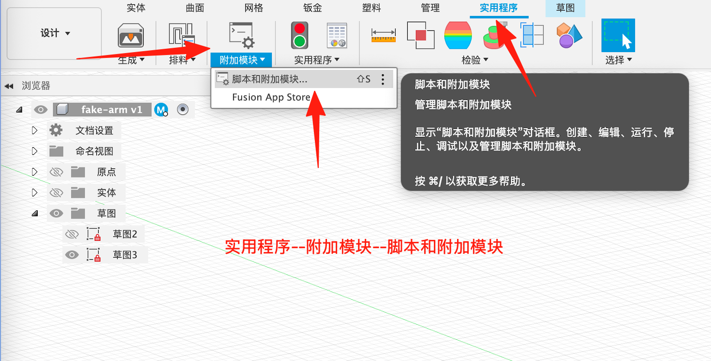
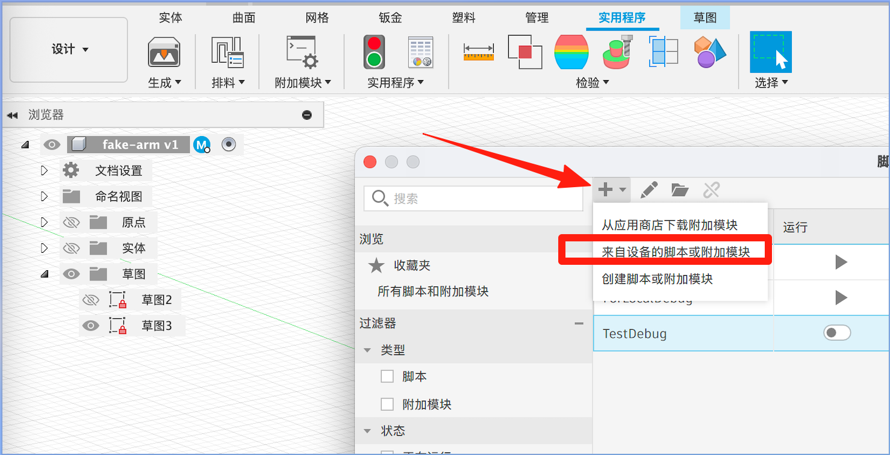
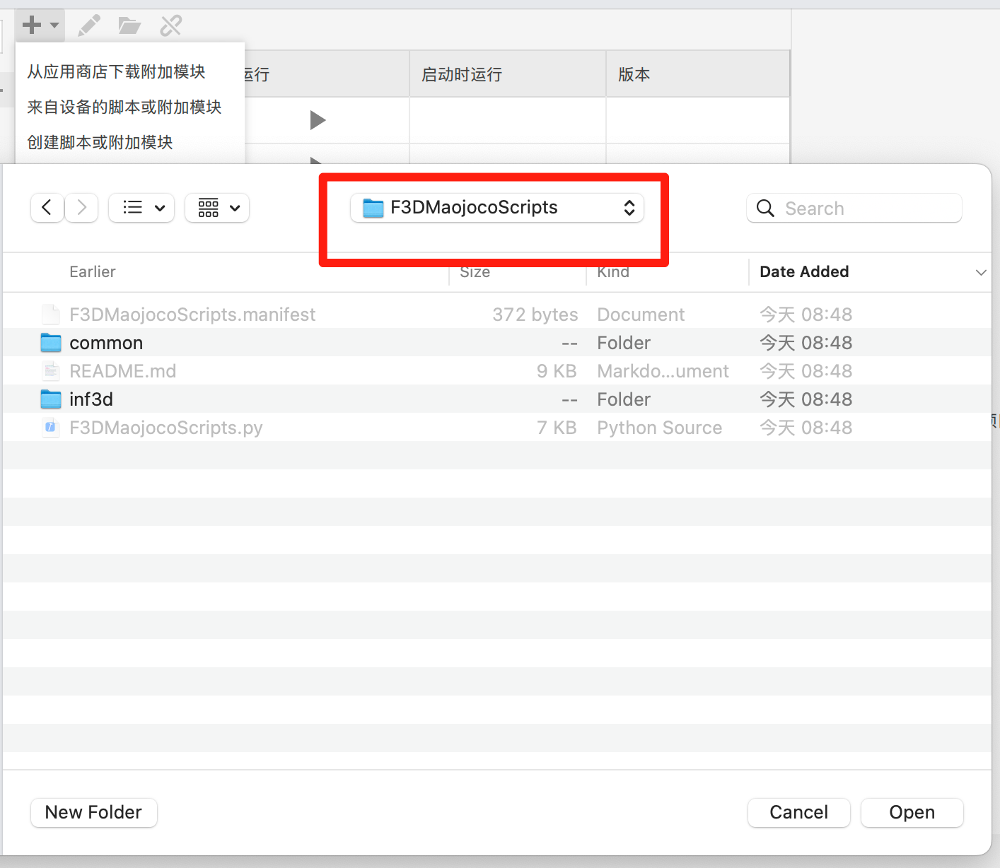
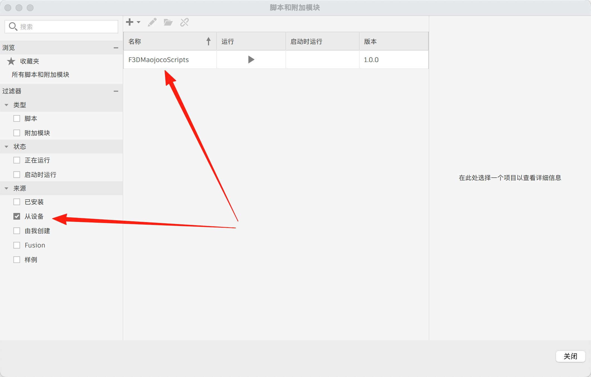

# F3DMaojocoScripts

Fusion 360 到 MuJoCo 的数据导出脚本模块，为机器人仿真提供类型安全的几何计算和数据导出功能。

## 概述

F3DMaojocoScripts 是一个 Fusion 360 插件脚本，用于从 Fusion 360 装配体中提取 3D 模型数据、关节约束和几何信息，并将其导出为适合 MuJoCo 仿真的格式。该模块是将复杂机械设计转换为基于物理的仿真的第一步。

## 安装过程图示

##### 步骤 1: 打开脚本和附加模块管理器


##### 步骤 2: 选择"来自设备的脚本"


##### 步骤 3: 定位到 F3DMaojocoScripts 文件夹


##### 步骤 4: 添加成功验证


## 模块架构设计

F3DMaojocoScripts 采用分层模块架构，将功能清晰地划分为两个主要模块，实现代码复用和开发协作的优化：

### 模块结构

```
F3DMaojocoScripts/
├── F3DMaojocoScripts.manifest    # Fusion 360 插件清单文件
├── F3DMaojocoScripts.py          # 主入口点
├── README.md                     # 本文档
├── common/                       # 通用共享模块（无外部依赖）
│   ├── backup_manager.py         # 备份和版本管理
│   ├── data_types.py            # 共享数据类型定义
│   └── geometry_math.py          # 核心几何数学库
└── inf3d/                        # Fusion 360 特定模块
    ├── component_collector.py    # 零部件信息收集
    ├── data_serializer.py       # 数据序列化为 JSON
    ├── export_analyzer.py       # 导出结果分析
    ├── fusion_export_manager.py  # 主导出协调器
    ├── joint_analyzer.py        # 关节约束分析
    ├── joint_limits_extractor.py # 关节运动限制提取
    ├── logger.py                 # 日志工具
    └── stl_exporter.py          # STL 几何导出
```

### 模块职责分离

#### common 模块 - 核心共享库

**设计目标**: 
- 提供可被其他项目安全复用的核心功能
- 无外部依赖，纯 Python 实现
- 为 AI 协同开发提供精确的上下文

**核心组件**:
- **geometry_math.py**: 完整的 3D 几何计算库
  - Vector3D, Quaternion, Transform4D, BoundingBox
  - 支持向量运算、坐标变换、碰撞检测
  - 适用于任何需要 3D 几何计算的项目

- **data_types.py**: 标准化数据结构
  - ExportData, ComponentInfo, JointInfo
  - 提供完整的数据序列化/反序列化
  - 作为项目间数据交换的标准格式

- **backup_manager.py**: 通用备份管理
  - 版本控制和数据安全
  - 可独立用于其他需要备份功能的项目

**使用场景**:
```python
# 其他项目可以安全导入 common 模块
from F3DMaojocoScripts.common.geometry_math import Vector3D, Transform4D
from F3DMaojocoScripts.common.data_types import ExportData, load_export_data

# 无需担心 Fusion 360 依赖问题
vec = Vector3D(1.0, 2.0, 3.0)
transform = Transform4D.from_translation(vec)
```

#### inf3d 模块 - Fusion 360 特定实现

**设计目标**:
- 专门处理 Fusion 360 API 交互
- 依赖 `adsk` 模块，只能在 Fusion 360 环境运行
- 利用 common 模块提供的核心功能

**核心组件**:
- **fusion_export_manager.py**: 导出流程协调
- **component_collector.py**: 零部件数据提取
- **joint_analyzer.py**: 关节约束分析
- **stl_exporter.py**: 几何文件导出

### 模块依赖关系

```
其他项目
    ↓ (安全导入)
common/ ←───────────┐
    ↓ (单向依赖)     │
inf3d/              │
    ↓ (依赖 adsk)    │
Fusion 360 API ──────┘
```

**依赖原则**:
- `common/` 模块完全独立，无外部依赖
- `inf3d/` 模块依赖 `common/` 模块和 `adsk` (Fusion 360 API)
- 严格避免循环依赖
- 支持渐进式开发和测试

### AI 协同开发优势

这种模块化设计为 AI 协同开发提供了显著优势：

1. **精确上下文**: AI 可以专注于 `common/` 模块进行功能增强
2. **安全测试**: 可以独立测试 `common/` 模块而无需 Fusion 360 环境
3. **代码复用**: `common/` 模块的功能可以在多个项目中共享
4. **渐进开发**: 可以先完善核心算法，再集成到特定平台
5. **问题隔离**: 问题定位更精确，知道是核心算法问题还是平台集成问题

### 扩展性设计

这种架构支持以下扩展模式：

- **新平台支持**: 复用 `common/` 模块，开发新的平台特定模块
- **功能增强**: 在 `common/` 模块中添加新的几何算法或数据类型
- **工具集成**: 其他工具可以直接导入 `common/` 模块进行数据处理

## 安装与使用

### Fusion 360 插件使用

#### 添加脚本到 Fusion 360

以下是完整的添加步骤：

1. **打开脚本和附加模块管理器**
   - 在 Fusion 360 中，点击顶部菜单的 "工具" → "脚本和附加模块"

2. **选择脚本来源**
   - 在脚本和附加模块窗口中，点击 "创建" → "来自设备的脚本"
   - 选择 "Python" 作为脚本类型

3. **定位到 F3DMaojocoScripts 文件夹**
   - 在文件夹选择器中，导航到包含 `F3DMaojocoScripts` 的目录
   - 选择整个文件夹并点击 "选择文件夹"

4. **验证添加成功**
   - 脚本将出现在 "脚本" 和 "附加模块" 列表中
   - 建议勾选左侧的 "从设备" 选项，方便快速访问

#### 运行脚本

1. 打开您的 Fusion 360 装配体
2. 从脚本菜单运行 F3DMaojocoScripts
3. 配置导出选项（网格质量、输出目录）
4. 执行导出以生成：
   - `component_positions.json` - 零部件和关节数据
   - `stl_files/` 目录 - STL 几何文件
   - 导出描述和日志文件

### 开发调试

对于开发人员，模块支持热更新：
- 直接修改代码文件
- Fusion 360 在下一次运行时会自动加载最新版本
- 无需重新安装或重启 Fusion 360

### 运行导出

1. 打开您的 Fusion 360 装配体
2. 从脚本菜单运行 F3DMaojocoScripts
3. 配置导出选项（网格质量、输出目录）
4. 执行导出以生成：
   - `component_positions.json` - 零部件和关节数据
   - `stl_files/` 目录 - STL 几何文件
   - 导出描述和日志文件

## 核心功能

### 几何数学（`common/geometry_math.py`）

模块提供完整的几何计算库：

- **Vector3D**: 3D 向量运算（加法、减法、点积、叉积）
- **Quaternion**: 旋转表示与矩阵转换
- **Transform4D**: 4x4 变换矩阵用于坐标系
- **BoundingBox**: 轴对齐包围盒用于碰撞检测
- **GeometryUtils**: 常用几何计算

### 数据类型（`common/data_types.py`）

机器人仿真的综合数据结构：

- **ExportData**: 包含元数据、零部件和关节的完整导出容器
- **ComponentInfo**: 详细的零部件几何、位置和文件信息
- **JointInfo**: 关节类型、约束和连接关系
- **ExportMetadata**: 导出会话信息和版本控制

### Fusion 360 集成（`inf3d/`）

用于 Fusion 360 数据提取的专门模块：

#### FusionExportManager
- 协调整个导出工作流
- 管理零部件收集、关节分析和 STL 导出
- 提供进度跟踪和错误处理

#### ComponentCollector
- 递归遍历装配体层次结构
- 提取几何信息和变换矩阵
- 生成完整的零部件元数据

#### JointAnalyzer
- 识别和分类关节类型（RIGID、REVOLUTE、SLIDER 等）
- 将 Fusion 360 关节映射到 MuJoCo 关节类型
- 提取关节几何和约束

#### STLExporter
- 将零部件几何导出为 STL 文件
- 可配置的网格质量（LOW/MEDIUM/HIGH）
- 批量导出和文件管理

## 数据流架构

```
Fusion 360 设计
    ↓
F3DMaojocoScripts (数据提取)
    ↓
ExportData (JSON + STL 文件)
    ↓
MaojocoConverter (单位转换)
    ↓
MuJoCo 模型 (XML + STL)
```

### ExportData 结构

`ExportData` 类作为中心数据容器：

```python
@dataclass
class ExportData:
    meta: ExportMetadata           # 导出会话信息
    components: List[ComponentInfo]  # 所有零部件数据
    joints: List[JointInfo]         # 所有关节数据
```

**关键组件：**
- **ExportMetadata**: 时间戳、导出模式、单位、版本信息
- **ComponentInfo**: 名称、变换、STL 文件路径、几何数据
- **JointInfo**: 关节类型、连接的零部件、运动限制、轴

## 单位系统

- **输入单位**: 毫米（mm）- 与 Fusion 360 匹配
- **输出单位**: 毫米（mm）- 在 MaojocoConverter 中转换为米
- **坐标系**: 右手系，与 Fusion 360 匹配

## 文件输出

导出过程生成多个输出文件：

```
output_directory/
├── component_positions.json  # 主要导出数据
├── stl_files/                # STL 几何文件
│   ├── component1.stl
│   └── component2.stl
├── export_description_*.md   # 人类可读的摘要
└── f3d_export.log           # 执行日志
```

## 依赖关系

### 运行时依赖
- **Fusion 360 API** (`adsk`): Fusion 360 集成必需
- **Python 3.12+**: 最低支持版本

### 模块依赖
- `common/` 模块: 纯 Python，无外部依赖
- `inf3d/` 模块: 依赖 `adsk` (Fusion 360 API)

## 外部使用

`common/` 模块可以在 Fusion 360 外部独立使用：

```python
# 几何计算
from F3DMaojocoScripts.common.geometry_math import Vector3D, Transform4D

vec = Vector3D(1.0, 2.0, 3.0)
transform = Transform4D.from_translation(vec)

# 数据处理
from F3DMaojocoScripts.common.data_types import ExportData, load_export_data

export_data = load_export_data("component_positions.json")
```

## 错误处理与日志记录

- `inf3d/logger.py` 中的综合日志系统
- 每个处理阶段的错误处理
- 详细的进度报告
- 数据安全的备份管理

## 版本信息

- **版本**: 1.0.0
- **作者**: MaoLab
- **Python 版本**: 3.12+
- **Fusion 360**: 支持最新版本