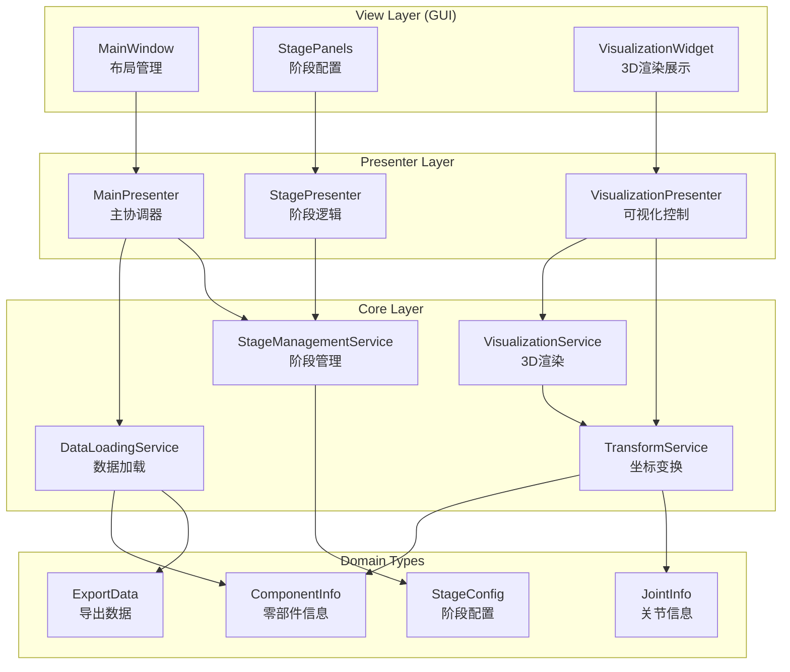
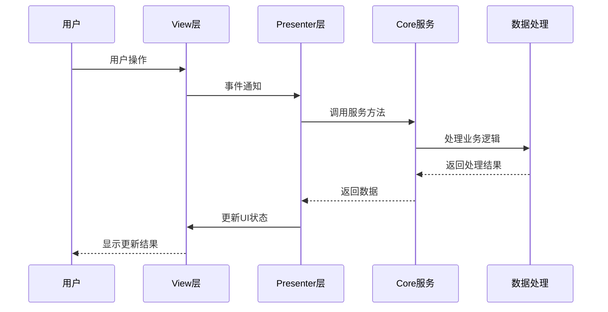
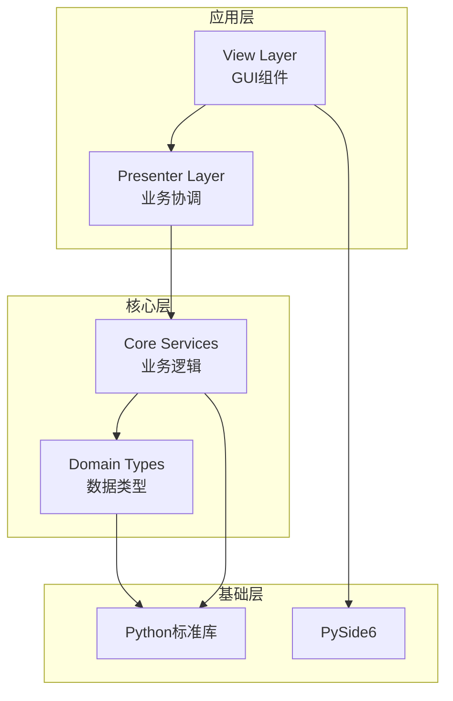
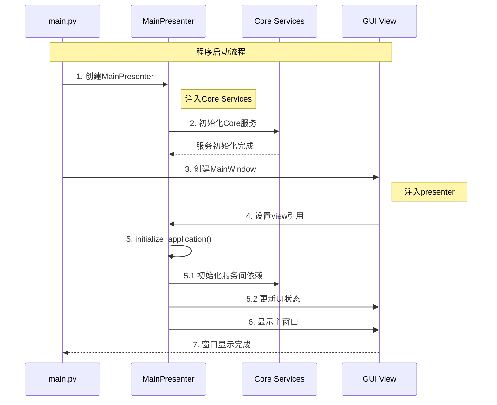
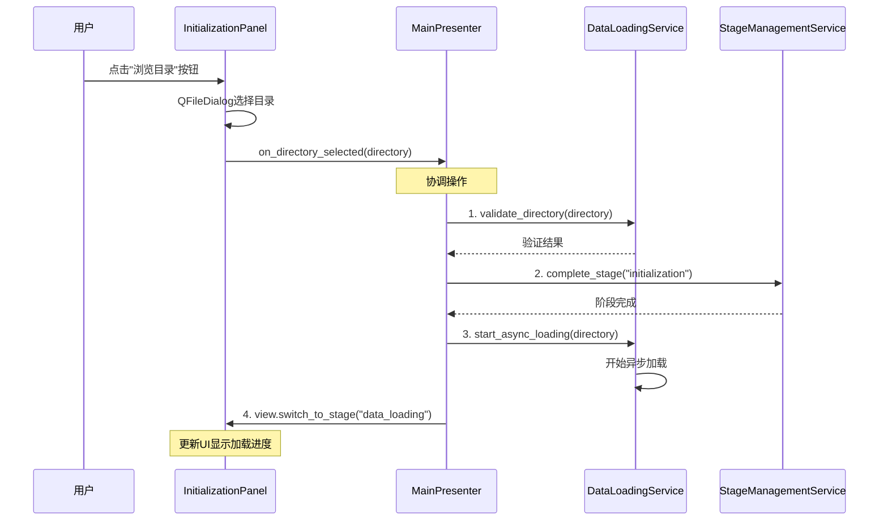
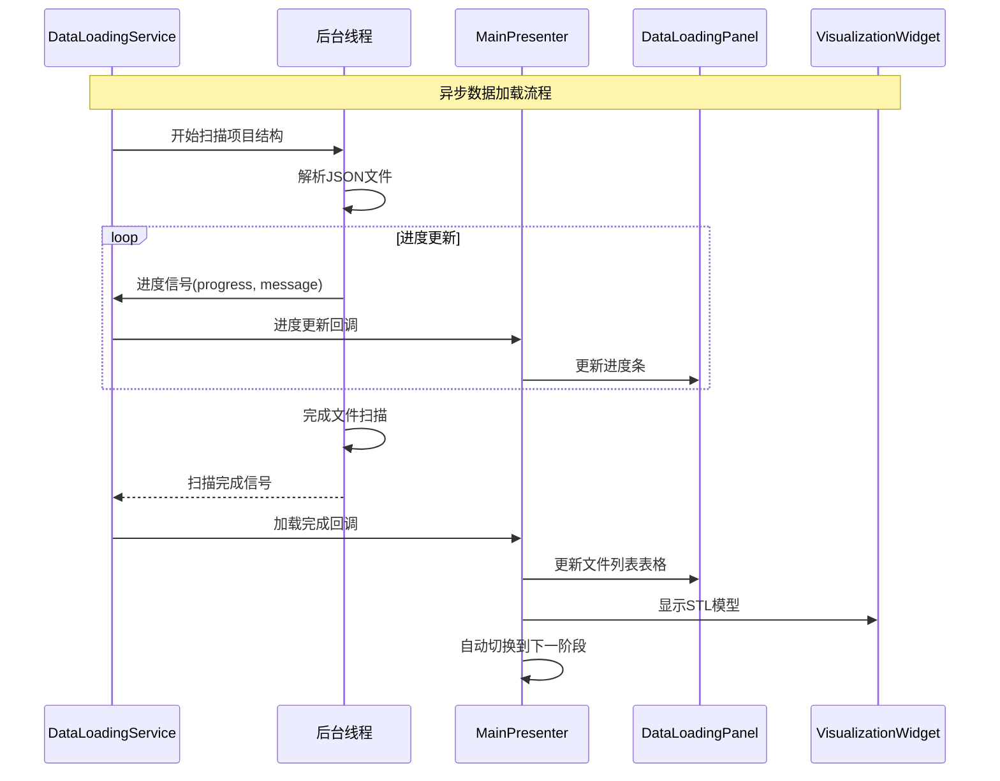

# MaojocoConverter 现有功能重构计划

## 📋 概述

基于现有代码分析，制定专注于现有功能重构的具体实施计划。目标是将业务逻辑从UI层分离，建立清晰的分层架构，同时保持所有现有功能正常工作。

## 🎯 重构范围

### 当前代码结构分析
- **stage_panels.py (950行)**: 阶段管理 + UI逻辑混合
- **async_data_loader.py (284行)**: 数据加载逻辑应在Core层
- **visualization_widget.py (562行)**: 3D可视化 + 数据管理耦合

### 重构后的文件结构树

```
MaojocoConverterGUI/
├── main.py                          # 程序入口，依赖注入
├── core/                            # 核心业务逻辑层
│   ├── __init__.py
│   ├── domain_types.py              # 独立类型系统 ✅
│   │   ├── JointType, MeshQuality    # 枚举类型
│   │   ├── Vector3D, Transform4D    # 几何类型
│   │   ├── ComponentInfo, JointInfo # 业务实体
│   │   ├── ExportData, ProjectInfo  # 数据结构
│   │   └── StageConfig, LoadResult  # 配置和结果
│   ├── service_interfaces.py         # 服务接口定义
│   │   ├── IDataLoadingService      # 数据加载接口
│   │   ├── IVisualizationService    # 可视化接口
│   │   ├── IStageManagementService  # 阶段管理接口
│   │   └── ITransformService         # 坐标变换接口
│   ├── data_loading_service.py      # 数据加载服务
│   │   ├── DataLoadingService       # 主服务类
│   │   └── AsyncDataService          # 异步支持
│   ├── visualization_service.py     # 可视化服务
│   │   ├── VisualizationService      # 3D渲染服务
│   │   └── ModelRenderer            # 模型渲染器
│   ├── stage_management_service.py  # 阶段管理服务
│   │   ├── StageManagementService    # 阶段管理
│   │   └── StageExecutor             # 阶段执行器
│   ├── transform_service.py         # 坐标变换服务 (复用现有)
│   │   ├── TransformService          # 主服务类
│   │   └── LoadMode, LoadResult      # 加载模式和结果
│   ├── coordinate_transformer.py    # 坐标变换器 (现有)
│   ├── project_data_loader.py       # 项目数据加载器 (现有)
│   └── stl_model_manager.py         # STL模型管理器 (现有)
├── presenters/                       # 业务协调层
│   ├── __init__.py
│   ├── main_presenter.py             # 主协调器
│   │   └── MainPresenter             # 应用程序协调
│   ├── stage_presenter.py            # 阶段协调器
│   │   └── StagePresenter            # 阶段逻辑协调
│   └── visualization_presenter.py    # 可视化协调器
│       └── VisualizationPresenter    # 3D显示协调
├── gui/                             # 用户界面层
│   ├── __init__.py
│   ├── main_window.py                # 主窗口
│   │   └── MainWindow                 # 主窗口界面
│   ├── initialization_panel.py       # 初始化面板 (新)
│   │   └── InitializationPanel        # 目录选择界面
│   ├── data_loading_panel.py         # 数据加载面板 (新)
│   │   └── DataLoadingPanel          # 加载进度界面
│   ├── relationship_analysis_panel.py # 关系分析面板 (新)
│   │   └── RelationshipAnalysisPanel  # 分析配置界面
│   ├── unit_conversion_panel.py      # 单位转换面板 (新)
│   │   └── UnitConversionPanel       # 转换配置界面
│   ├── model_generation_panel.py     # 模型生成面板 (新)
│   │   └── ModelGenerationPanel      # 生成配置界面
│   ├── actuator_generation_panel.py  # 执行器生成面板 (新)
│   │   └── ActuatorGenerationPanel   # 执行器配置界面
│   ├── stage_panels.py               # 原有阶段面板 (重构)
│   │   ├── StageConfig                # 阶段配置类
│   │   ├── StagePanel                 # 阶段面板基类
│   │   ├── InitializationPanel       # 初始化面板 (旧)
│   │   ├── DataLoadingPanel           # 数据加载面板 (旧)
│   │   ├── RelationshipAnalysisPanel  # 关系分析面板 (旧)
│   │   ├── UnitConversionPanel       # 单位转换面板 (旧)
│   │   ├── ModelGenerationPanel      # 模型生成面板 (旧)
│   │   ├── ActuatorGenerationPanel   # 执行器生成面板 (旧)
│   │   └── StageManager               # 阶段管理器 (迁移到Core)
│   ├── async_data_loader.py          # 异步数据加载器 (迁移到Core)
│   │   ├── ProjectInfo                # 项目信息 (迁移到domain_types)
│   │   ├── ComponentInfo              # 组件信息 (迁移到domain_types)
│   │   ├── DataLoaderWorker          # 数据加载工作线程
│   │   └── AsyncDataManager           # 异步数据管理器
│   └── visualization_widget.py       # 3D可视化组件 (重构)
│       ├── VisualizationWidget       # 可视化组件 (简化)
│       └── QtInteractor               # PyVista交互器 (保留)
├── utils/                           # 工具类 (保持不变)
│   ├── __init__.py
│   ├── logger.py                     # 日志工具
│   └── ...                           # 其他工具
└── docs/                            # 文档 (保持不变)
    ├── refactoring_plan.md           # 原重构计划
    ├── detailed_refactoring_plan.md  # 详细重构计划
    ├── existing_functionality_refactoring_plan.md  # 现有功能重构计划 ✅
    └── ...
```

<details>
<summary>📁 <strong>core/</strong> 目录详细说明</summary>

### **domain_types.py** - 独立类型系统
```python
# 枚举类型
JointType, MeshQuality

# 几何类型  
Vector3D, Transform4D

# 业务实体
ComponentInfo, JointInfo, JointConnection, JointGeometry

# 数据结构
ExportData, ExportMetadata, ProjectInfo

# 配置和结果
StageConfig, LoadResult
```

### **service_interfaces.py** - 服务接口定义
```python
# 服务接口
IDataLoadingService     # 数据加载
IVisualizationService   # 可视化  
IStageManagementService # 阶段管理
ITransformService        # 坐标变换

# 支持类型
ProjectInfo, ExportData, StageConfig
```

### **data_loading_service.py** - 数据加载服务
```python
DataLoadingService      # 主服务，从AsyncDataManager重构
AsyncDataService         # 异步支持，从DataLoaderWorker重构

主要功能：
- 扫描项目结构
- 加载STL文件
- 验证数据完整性
- 异步进度通知
```

### **visualization_service.py** - 可视化服务
```python
VisualizationService    # 3D渲染服务，从VisualizationWidget重构
ModelRenderer           # 模型渲染器

主要功能：
- STL模型加载
- 3D渲染管理
- 相机控制
- 材质和光照设置
```

### **stage_management_service.py** - 阶段管理服务
```python
StageManagementService  # 阶段管理，从StageManager重构
StageExecutor           # 阶段执行器

主要功能：
- 阶段生命周期管理
- 阶段执行顺序控制
- 阶段状态维护
- 阶段间数据传递
```
</details>

<details>
<summary>📁 <strong>presenters/</strong> 目录详细说明</summary>

### **main_presenter.py** - 主协调器
```python
MainPresenter

主要职责：
- 应用程序初始化协调
- Core服务间依赖管理
- View状态同步
- 错误处理和用户反馈
```

### **stage_presenter.py** - 阶段协调器
```python
StagePresenter

主要职责：
- 阶段执行逻辑协调
- 阶段间数据流转
- 阶段UI状态管理
- 阶段错误处理
```

### **visualization_presenter.py** - 可视化协调器
```python
VisualizationPresenter

主要职责：
- 3D显示逻辑协调
- 模型加载和显示控制
- 视图状态管理
- 用户交互响应
```
</details>

<details>
<summary>📁 <strong>gui/</strong> 目录详细说明</summary>

### **main_window.py** - 主窗口 (新)
```python
MainWindow

主要职责：
- 应用程序主窗口布局
- 阶段面板容器管理
- 菜单和状态栏
- 窗口事件处理
```

### **阶段面板文件 (新文件，从stage_panels.py分离)**
```python
initialization_panel.py      # InitializationPanel
data_loading_panel.py        # DataLoadingPanel  
relationship_analysis_panel.py # RelationshipAnalysisPanel
unit_conversion_panel.py     # UnitConversionPanel
model_generation_panel.py    # ModelGenerationPanel
actuator_generation_panel.py # ActuatorGenerationPanel

每个面板只负责：
- UI组件创建和布局
- 用户输入处理
- 状态显示更新
```

### **原有文件重构说明**
```python
stage_panels.py (重构后)：
- 保留StageConfig和StagePanel基类
- 迁移StageManager到Core服务
- 简化各个阶段面板为纯UI组件

async_data_loader.py (迁移后)：
- 数据类型迁移到domain_types.py
- 核心逻辑迁移到data_loading_service.py
- 保留异步线程管理机制

visualization_widget.py (重构后)：
- 简化为纯UI包装器
- 渲染逻辑迁移到visualization_service.py
- 保留PyVista集成代码
```
</details>

### 重构前后对比

| 重构前 | 重构后 | 改进点 |
|--------|--------|--------|
| 3个大文件混合逻辑 | 17个职责单一文件 | 职责分离 |
| 业务逻辑嵌入UI | Core服务独立 | 可测试性 |
| 全局状态依赖 | 依赖注入 | 解耦 |
| 难以扩展 | 模块化设计 | 可维护性 |

### 重构目标
1. **业务逻辑分离**: 将业务逻辑从UI组件中提取到Core服务
2. **独立类型系统**: 从F3D复制类型，保持完全独立
3. **Presenter层建立**: 创建协调Core和View的中间层
4. **保持功能完整**: 确保重构过程中所有现有功能正常工作

## 🏗️ 架构设计

### 整体架构图



### 数据流向图



### 模块依赖关系



## 🏗️ 详细重构计划

### 阶段1: 基础架构搭建

#### 1.1 创建独立类型系统
**文件**: `core/domain_types.py`

```python
"""
从F3DMaojocoScripts复制的独立类型系统
保持完全独立，无外部依赖
"""

from dataclasses import dataclass, field
from typing import List, Optional, Dict, Any
from enum import Enum
from pathlib import Path

# 复制所有必要的数据类型
# - ComponentInfo, JointInfo, ExportData
# - Vector3D, Transform4D, JointType
# - 所有相关序列化/反序列化方法
```

#### 1.2 Core服务接口定义
**文件**: `core/service_interfaces.py`

```python
"""
Core服务接口定义
定义所有业务服务的抽象接口
"""

from abc import ABC, abstractmethod
from typing import List, Optional, Dict, Any
from pathlib import Path

class IDataLoadingService(ABC):
    @abstractmethod
    def load_project_data(self, input_directory: Path) -> ExportData:
        pass
    
    @abstractmethod
    def scan_project_structure(self, input_directory: Path) -> ProjectInfo:
        pass

class ITransformService(ABC):
    @abstractmethod
    def transform_stl_file(self, stl_path: Path, mode: LoadMode) -> bool:
        pass

class IVisualizationService(ABC):
    @abstractmethod
    def load_stl_model(self, file_path: Path) -> bool:
        pass
    
    @abstractmethod
    def display_transformed_models(self, meshes: List, colors: List[str]) -> bool:
        pass

class IStageManagementService(ABC):
    @abstractmethod
    def initialize_stages(self) -> None:
        pass
    
    @abstractmethod
    def execute_stage(self, stage_name: str) -> bool:
        pass
```

### 阶段2: 数据加载服务重构

#### 2.1 创建DataLoadingService
**文件**: `core/services/data_loading_service.py`

```python
"""
数据加载服务 - 从async_data_loader.py重构
将数据加载逻辑从UI层分离到Core服务
"""

import json
from typing import Dict, List, Any, Optional
from pathlib import Path
from dataclasses import dataclass

from .service_interfaces import IDataLoadingService
from .domain_types import ExportData, ProjectInfo, ComponentInfo

class DataLoadingService(IDataLoadingService):
    """数据加载服务实现"""
    
    def __init__(self):
        self._current_project_info: Optional[ProjectInfo] = None
        self._loaded_data: Optional[ExportData] = None
    
    def load_project_data(self, input_directory: Path) -> ExportData:
        """加载项目数据"""
        # 从async_data_loader.py迁移逻辑
        project_info = self.scan_project_structure(input_directory)
        stl_files = self._find_stl_files(input_directory)
        
        # 构建ExportData
        export_data = ExportData(
            meta=self._create_metadata(project_info),
            components=self._load_components(stl_files),
            joints=self._load_joints(input_directory)
        )
        
        self._loaded_data = export_data
        return export_data
    
    def scan_project_structure(self, input_directory: Path) -> ProjectInfo:
        """扫描项目结构"""
        # 迁移DataLoaderWorker._scan_project_structure逻辑
        pass
    
    def _find_stl_files(self, input_directory: Path) -> List[Path]:
        """查找STL文件"""
        # 迁移DataLoaderWorker._find_stl_files逻辑
        pass
    
    def _create_metadata(self, project_info: ProjectInfo) -> ExportMetadata:
        """创建导出元数据"""
        # 迁移相关逻辑
        pass
```

#### 2.2 重构异步支持
**文件**: `core/services/async_data_service.py`

```python
"""
异步数据服务 - 提供异步操作支持
基于async_data_loader.py的线程管理逻辑
"""

from PySide6.QtCore import QObject, Signal, QThread, QTimer
from typing import Optional, Callable

class AsyncDataService(QObject):
    """异步数据服务"""
    
    # 信号定义（从DataLoaderWorker迁移）
    progress_updated = Signal(int, str)
    scan_completed = Signal(object, object)  # ProjectInfo
    loading_completed = Signal(list, list)
    error_occurred = Signal(str)
    
    def __init__(self, data_service: IDataLoadingService):
        super().__init__()
        self._data_service = data_service
        self._worker = None
        self._thread = None
    
    def start_async_loading(self, input_directory: Path):
        """开始异步加载"""
        # 迁移AsyncDataManager的逻辑
        pass
```

### 阶段3: 可视化服务重构

#### 3.1 创建VisualizationService
**文件**: `core/services/visualization_service.py`

```python
"""
可视化服务 - 从visualization_widget.py重构
将3D渲染逻辑从UI组件分离到Core服务
"""

import pyvista as pv
from typing import List, Optional, Any
from pathlib import Path

from .service_interfaces import IVisualizationService
from .domain_types import Vector3D, Transform4D

class VisualizationService(IVisualizationService):
    """可视化服务实现"""
    
    def __init__(self):
        self._plotter: Optional[pv.Plotter] = None
        self._current_models: List[Any] = []
    
    def initialize_renderer(self, parent_widget=None):
        """初始化渲染器"""
        # 从VisualizationWidget._setup_pyvista迁移逻辑
        pass
    
    def load_stl_model(self, file_path: Path) -> bool:
        """加载STL模型"""
        # 迁移VisualizationWidget.load_stl_model逻辑
        pass
    
    def display_transformed_models(self, meshes: List[pv.PolyData], colors: List[str]) -> bool:
        """显示已变换的模型"""
        # 迁移VisualizationWidget.display_transformed_models逻辑
        pass
    
    def clear_all_models(self) -> None:
        """清除所有模型"""
        # 迁移VisualizationWidget.clear_all_models逻辑
        pass
```

#### 3.2 简化VisualizationWidget
**文件**: `gui/visualization_widget.py` (重构后)

```python
"""
简化的可视化组件 - 只负责UI，不处理业务逻辑
"""

from PySide6.QtWidgets import QWidget
from core.services.visualization_service import IVisualizationService

class VisualizationWidget(QWidget):
    """简化的3D可视化组件"""
    
    def __init__(self, visualization_service: IVisualizationService, parent=None):
        super().__init__(parent)
        self._visualization_service = visualization_service
        self._setup_ui()
    
    def _setup_ui(self):
        """只负责UI设置，业务逻辑委托给service"""
        # 简化的UI设置逻辑
        pass
    
    def load_model(self, file_path: str):
        """委托给service处理"""
        self._visualization_service.load_stl_model(Path(file_path))
```

### 阶段4: 阶段管理服务重构

#### 4.1 创建StageManagementService
**文件**: `core/services/stage_management_service.py`

```python
"""
阶段管理服务 - 从StageManager重构
将阶段管理逻辑从UI分离到Core服务
"""

from typing import Dict, Optional, List
from .service_interfaces import IStageManagementService
from .domain_types import StageConfig

class StageManagementService(IStageManagementService):
    """阶段管理服务实现"""
    
    def __init__(self):
        self._stages: Dict[str, StageConfig] = {}
        self._current_stage: Optional[str] = None
        self._stage_execution_order = [
            "initialization",
            "data_loading", 
            "relationship_analysis",
            "unit_conversion",
            "model_generation",
            "actuator_generation"
        ]
    
    def initialize_stages(self) -> None:
        """初始化所有阶段"""
        # 迁移StageManager.__init__的逻辑
        pass
    
    def execute_stage(self, stage_name: str) -> bool:
        """执行指定阶段"""
        # 迁移StageManager._on_stage_completed逻辑
        pass
    
    def switch_to_stage(self, stage_name: str) -> None:
        """切换到指定阶段"""
        # 迁移StageManager.switch_to_stage逻辑
        pass
    
    def get_current_stage(self) -> Optional[str]:
        """获取当前阶段"""
        return self._current_stage
```

#### 4.2 重构StagePanel基类
**文件**: `gui/stage_panels.py` (重构后)

```python
"""
重构后的阶段面板 - 业务逻辑委托给Presenter
"""

from abc import ABC, abstractmethod
from typing import Optional
from PySide6.QtWidgets import QWidget, QVBoxLayout

class StagePanel(QWidget):
    """简化的阶段面板基类"""
    
    def __init__(self, stage_name: str, presenter, parent=None):
        super().__init__(parent)
        self.stage_name = stage_name
        self._presenter = presenter
        self._setup_ui()
    
    def _setup_ui(self):
        """只负责UI设置"""
        # 基础UI布局
        main_layout = QVBoxLayout(self)
        self.content_layout = QVBoxLayout()
        main_layout.addLayout(self.content_layout)
    
    def on_execute_clicked(self):
        """执行按钮点击 - 委托给presenter"""
        self._presenter.execute_stage(self.stage_name)
    
    def update_ui_from_config(self, config: StageConfig):
        """根据配置更新UI - 由presenter调用"""
        # 子类实现具体的UI更新逻辑
        pass
```

### 阶段5: Presenter层实现

#### 5.1 创建MainPresenter
**文件**: `presenters/main_presenter.py`

```python
"""
主Presenter - 协调Core服务和View层
"""

from typing import Optional
from core.services import (
    IDataLoadingService, 
    IVisualizationService, 
    IStageManagementService,
    ITransformService
)

class MainPresenter:
    """主Presenter"""
    
    def __init__(self, 
                 data_service: IDataLoadingService,
                 visualization_service: IVisualizationService,
                 stage_service: IStageManagementService,
                 transform_service: ITransformService):
        self._data_service = data_service
        self._visualization_service = visualization_service
        self._stage_service = stage_service
        self._transform_service = transform_service
        
        self._view = None  # 将在set_view时设置
    
    def set_view(self, view):
        """设置关联的View"""
        self._view = view
    
    def initialize_application(self):
        """初始化应用程序"""
        # 初始化所有服务
        self._stage_service.initialize_stages()
        self._visualization_service.initialize_renderer()
        
        # 初始化UI
        if self._view:
            self._view.update_stage_list()
            self._view.switch_to_stage("initialization")
    
    def execute_stage(self, stage_name: str):
        """执行阶段"""
        try:
            success = self._stage_service.execute_stage(stage_name)
            if success:
                self._handle_stage_completion(stage_name)
            else:
                self._handle_stage_error(stage_name, "执行失败")
        except Exception as e:
            self._handle_stage_error(stage_name, str(e))
    
    def _handle_stage_completion(self, stage_name: str):
        """处理阶段完成"""
        # 更新UI状态
        if self._view:
            self._view.on_stage_completed(stage_name)
        
        # 自动切换到下一阶段
        next_stage = self._get_next_stage(stage_name)
        if next_stage:
            self._stage_service.switch_to_stage(next_stage)
            if self._view:
                self._view.switch_to_stage(next_stage)
    
    def _handle_stage_error(self, stage_name: str, error_msg: str):
        """处理阶段错误"""
        if self._view:
            self._view.on_stage_error(stage_name, error_msg)
    
    def _get_next_stage(self, current_stage: str) -> Optional[str]:
        """获取下一阶段"""
        stages = self._stage_service.get_stage_execution_order()
        try:
            current_index = stages.index(current_stage)
            if current_index < len(stages) - 1:
                return stages[current_index + 1]
        except ValueError:
            pass
        return None
```

### 阶段6: UI组件重构

#### 6.1 重构InitializationPanel
**文件**: `gui/initialization_panel.py` (新文件)

```python
"""
初始化面板 - 只负责UI，逻辑委托给presenter
"""

from PySide6.QtWidgets import QWidget, QVBoxLayout, QLabel, QPushButton, QFileDialog
from PySide6.QtCore import Signal
from pathlib import Path

class InitializationPanel(QWidget):
    """初始化面板"""
    
    directory_selected = Signal(Path)  # 信号：目录选择完成
    
    def __init__(self, presenter, parent=None):
        super().__init__(parent)
        self._presenter = presenter
        self._input_directory: Optional[Path] = None
        self._setup_ui()
    
    def _setup_ui(self):
        """设置UI界面"""
        layout = QVBoxLayout(self)
        
        # 说明文字
        info_label = QLabel("请选择包含导出数据的目录")
        layout.addWidget(info_label)
        
        # 目录选择按钮
        self.browse_button = QPushButton("浏览目录")
        self.browse_button.clicked.connect(self._browse_directory)
        layout.addWidget(self.browse_button)
        
        # 当前目录显示
        self.directory_label = QLabel("未选择目录")
        layout.addWidget(self.directory_label)
    
    def _browse_directory(self):
        """浏览目录"""
        directory = QFileDialog.getExistingDirectory(
            self, "选择包含导出数据的目录"
        )
        
        if directory:
            self._input_directory = Path(directory)
            self.directory_label.setText(str(self._input_directory))
            self.directory_selected.emit(self._input_directory)
            
            # 委托给presenter处理
            self._presenter.on_directory_selected(self._input_directory)
```

#### 6.2 重构DataLoadingPanel
**文件**: `gui/data_loading_panel.py` (新文件)

```python
"""
数据加载面板 - 只负责UI，逻辑委托给presenter
"""

from PySide6.QtWidgets import QWidget, QVBoxLayout, QTableWidget, QProgressBar
from PySide6.QtCore import Signal

class DataLoadingPanel(QWidget):
    """数据加载面板"""
    
    def __init__(self, presenter, parent=None):
        super().__init__(parent)
        self._presenter = presenter
        self._setup_ui()
    
    def _setup_ui(self):
        """设置UI界面"""
        layout = QVBoxLayout(self)
        
        # 项目信息显示
        self.project_info_label = QLabel("项目信息")
        layout.addWidget(self.project_info_label)
        
        # 进度条
        self.progress_bar = QProgressBar()
        layout.addWidget(self.progress_bar)
        
        # 文件列表表格
        self.files_table = QTableWidget()
        self.files_table.setColumnCount(4)
        self.files_table.setHorizontalHeaderLabels(["文件名", "大小", "状态", "进度"])
        layout.addWidget(self.files_table)
    
    def update_progress(self, progress: int, message: str):
        """更新进度显示"""
        self.progress_bar.setValue(progress)
        # 更新其他UI元素
    
    def update_file_table(self, successful_files: list, failed_files: list):
        """更新文件表格"""
        # 只负责UI更新，不处理业务逻辑
        pass
    
    def on_loading_completed(self):
        """加载完成处理"""
        # 委托给presenter
        self._presenter.on_data_loading_completed()
```

### 阶段7: 主窗口重构

#### 7.1 重构MainWindow
**文件**: `gui/main_window.py` (重构后)

```python
"""
重构后的主窗口 - 只负责UI布局，业务逻辑委托给presenter
"""

from PySide6.QtWidgets import QMainWindow, QWidget, QVBoxLayout, QHBoxLayout
from presenters.main_presenter import MainPresenter

class MainWindow(QMainWindow):
    """主窗口"""
    
    def __init__(self, presenter: MainPresenter):
        super().__init__()
        self._presenter = presenter
        self._presenter.set_view(self)
        self._setup_ui()
    
    def _setup_ui(self):
        """设置UI界面"""
        central_widget = QWidget()
        self.setCentralWidget(central_widget)
        
        # 主布局
        main_layout = QHBoxLayout(central_widget)
        
        # 左侧阶段面板
        self.stage_container = QWidget()
        self.stage_layout = QVBoxLayout(self.stage_container)
        main_layout.addWidget(self.stage_container, 1)
        
        # 右侧3D可视化
        from gui.visualization_widget import VisualizationWidget
        self.visualization_widget = VisualizationWidget(
            self._presenter._visualization_service
        )
        main_layout.addWidget(self.visualization_widget, 2)
        
        # 初始化应用程序
        self._presenter.initialize_application()
    
    def update_stage_list(self):
        """更新阶段列表"""
        # 根据当前服务状态更新UI
        pass
    
    def switch_to_stage(self, stage_name: str):
        """切换到指定阶段"""
        # 更新UI显示
        pass
    
    def on_stage_completed(self, stage_name: str):
        """阶段完成处理"""
        # 更新UI状态
        pass
    
    def on_stage_error(self, stage_name: str, error_msg: str):
        """阶段错误处理"""
        # 显示错误信息
        pass
```

## 🔄 迁移策略

### 渐进式迁移步骤

1. **阶段1-2**: 创建Core服务接口和基础实现，保持原有UI不变
2. **阶段3-4**: 逐步将业务逻辑从UI组件迁移到服务层
3. **阶段5**: 实现Presenter层，建立服务层和UI层的桥梁
4. **阶段6-7**: 重构UI组件，使其只负责显示和用户交互

### 阶段性验证内容

#### ✅ 阶段1验证：基础架构搭建
**验证目标**: 确保基础架构正确搭建，类型系统和服务接口设计合理

**验证方法**:
```python
# 1. 类型系统验证
def test_domain_types():
    """验证独立类型系统的完整性"""
    # 测试所有类型可以正常导入和使用
    from core.domain_types import ComponentInfo, JointInfo, ExportData
    
    # 测试序列化/反序列化
    component = ComponentInfo(name="test", file_path=Path("test.stl"))
    serialized = component.to_dict()
    deserialized = ComponentInfo.from_dict(serialized)
    assert component.name == deserialized.name

# 2. 服务接口验证  
def test_service_interfaces():
    """验证服务接口定义的完整性"""
    from core.service_interfaces import IDataLoadingService
    
    # 测试接口方法签名正确
    methods = IDataLoadingService.__abstractmethods__
    assert 'load_project_data' in methods
    assert 'scan_project_structure' in methods
```

**验收标准**:
- [ ] 所有domain_types可以正常导入和实例化
- [ ] 服务接口定义完整，方法签名正确
- [ ] 类型检查通过（mypy验证）
- [ ] 导入依赖无循环引用

#### ✅ 阶段2验证：数据加载服务重构
**验证目标**: 确保数据加载功能从UI迁移到Core服务后功能完整

**验证方法**:
```python
# 1. 服务功能验证
def test_data_loading_service():
    """验证数据加载服务功能"""
    service = DataLoadingService()
    
    # 测试项目扫描
    project_info = service.scan_project_structure(test_directory)
    assert project_info.component_count > 0
    
    # 测试数据加载
    export_data = service.load_project_data(test_directory)
    assert len(export_data.components) > 0
    assert len(export_data.joints) >= 0

# 2. 异步功能验证
def test_async_data_service():
    """验证异步数据加载功能"""
    service = AsyncDataService(DataLoadingService())
    
    # 测试信号连接
    progress_received = []
    service.progress_updated.connect(lambda p, m: progress_received.append((p, m)))
    
    # 执行异步加载
    service.start_async_loading(test_directory)
    assert len(progress_received) > 0  # 确保进度更新正常
```

**验收标准**:
- [ ] DataLoadingService可以独立运行并正确加载数据
- [ ] 异步进度通知机制正常工作
- [ ] 错误处理机制完整
- [ ] 与原有async_data_loader.py功能对等

#### ✅ 阶段3验证：可视化服务重构
**验证目标**: 确保3D可视化功能从UI组件迁移到Core服务后渲染正常

**验证方法**:
```python
# 1. 渲染服务验证
def test_visualization_service():
    """验证可视化服务功能"""
    service = VisualizationService()
    
    # 测试初始化
    service.initialize_renderer()
    
    # 测试模型加载
    result = service.load_stl_model(test_stl_file)
    assert result == True
    
    # 测试显示控制
    meshes = [test_mesh_data]
    colors = ["red"]
    result = service.display_transformed_models(meshes, colors)
    assert result == True

# 2. 集成验证
def test_visualization_integration():
    """验证可视化服务与TransformService集成"""
    viz_service = VisualizationService()
    transform_service = TransformService()
    
    # 设置依赖
    viz_service.set_transform_service(transform_service)
    
    # 测试完整流程
    load_result = transform_service.load_project(test_directory)
    assert load_result.success
    
    # 验证可以正常显示变换后的模型
    assert viz_service.display_transformed_models(load_result.models, ["blue"])
```

**验收标准**:
- [ ] VisualizationService可以独立完成3D渲染
- [ ] 模型加载和显示功能正常
- [ ] 与TransformService集成正确
- [ ] 渲染效果与原有visualization_widget.py一致

#### ✅ 阶段4验证：阶段管理服务重构
**验证目标**: 确保阶段管理功能从UI迁移到Core服务后流程控制正常

**验证方法**:
```python
# 1. 阶段管理验证
def test_stage_management_service():
    """验证阶段管理服务功能"""
    service = StageManagementService()
    
    # 测试阶段初始化
    service.initialize_stages()
    stages = service.get_all_stages()
    assert len(stages) == 6  # 6个阶段
    
    # 测试阶段执行
    result = service.execute_stage("initialization")
    assert result == True
    
    # 测试阶段切换
    service.switch_to_stage("data_loading")
    assert service.get_current_stage() == "data_loading"

# 2. 流程控制验证
def test_stage_flow_control():
    """验证阶段流程控制"""
    service = StageManagementService()
    
    # 测试顺序执行
    service.initialize_stages()
    
    # 模拟完成前一阶段
    service.complete_stage("initialization")
    
    # 验证自动切换到下一阶段
    assert service.get_current_stage() == "data_loading"
```

**验收标准**:
- [ ] StageManagementService可以管理所有6个阶段
- [ ] 阶段执行顺序正确
- [ ] 阶间切换机制正常
- [ ] 与原有StageManager功能对等

#### ✅ 阶段5验证：Presenter层实现
**验证目标**: 确保Presenter层能正确协调Core服务和View层

**验证方法**:
```python
# 1. 主Presenter验证
def test_main_presenter():
    """验证主Presenter协调功能"""
    # 创建Mock服务
    mock_services = create_mock_services()
    presenter = MainPresenter(**mock_services)
    
    # 测试应用初始化
    presenter.initialize_application()
    
    # 测试阶段执行协调
    presenter.execute_stage("initialization")
    
    # 验证服务间调用正确
    assert mock_services['stage_management'].initialize_called
    assert mock_services['visualization'].initialize_called

# 2. 信号连接验证
def test_presenter_signal_handling():
    """验证Presenter信号处理"""
    presenter = MainPresenter(**create_mock_services())
    
    # 模拟View事件
    presenter.on_directory_selected(test_directory)
    
    # 验证正确的服务调用序列
    assert presenter._data_service.validate_directory_called
    assert presenter._stage_service.complete_stage_called
```

**验收标准**:
- [ ] MainPresenter能正确初始化所有服务
- [ ] Presenter能处理用户操作并调用相应服务
- [ ] 服务间依赖关系正确建立
- [ ] 错误处理机制完善

#### ✅ 阶段6验证：UI组件重构
**验证目标**: 确保重构后的UI组件功能完整且只负责显示和交互

**验证方法**:
```python
# 1. UI组件功能验证
def test_ui_components():
    """验证UI组件基本功能"""
    # 测试InitializationPanel
    init_panel = InitializationPanel(presenter=mock_presenter)
    assert init_panel.directory_selected is not None
    
    # 测试DataLoadingPanel  
    data_panel = DataLoadingPanel(presenter=mock_presenter)
    assert data_panel.preview_requested is not None
    
    # 测试信号连接
    init_panel.directory_selected.connect(mock_handler)
    init_panel._browse_directory()  # 模拟用户操作

# 2. UI-Presenter集成验证
def test_ui_presenter_integration():
    """验证UI与Presenter集成"""
    presenter = MainPresenter(**create_real_services())
    
    # 创建MainWindow
    main_window = MainWindow(presenter)
    
    # 模拟用户操作流程
    main_window.initialization_panel._browse_directory()
    # 验证整个流程正常执行
```

**验收标准**:
- [ ] 所有UI组件可以正常创建和显示
- [ ] 用户交互事件正确传递给Presenter
- [ ] UI状态更新机制正常
- [ ] 界面布局和用户体验与重构前一致

#### ✅ 阶段7验证：完整集成测试
**验证目标**: 确保整个重构后系统功能完整且性能达标

**验证方法**:
```python
# 1. 端到端功能测试
def test_end_to_end_functionality():
    """端到端功能测试"""
    # 创建完整系统
    app = create_test_application()
    
    # 模拟完整用户流程
    # 1. 选择目录
    app.select_test_directory()
    
    # 2. 数据加载
    app.wait_for_data_loading()
    
    # 3. 验证3D显示
    assert app.visualization_has_models()
    
    # 4. 阶段切换
    app.switch_to_next_stage()
    
    # 5. 验证数据一致性
    assert app.data_is_consistent()

# 2. 性能测试
def test_performance():
    """性能对比测试"""
    import time
    
    # 测试启动时间
    start_time = time.time()
    app = create_test_application()
    startup_time = time.time() - start_time
    
    # 测试数据加载时间
    start_time = time.time()
    app.load_test_data()
    load_time = time.time() - start_time
    
    # 与重构前对比
    assert startup_time < old_startup_time * 1.2  # 允许20%性能损失
    assert load_time < old_load_time * 1.2
```

**验收标准**:
- [ ] 完整用户流程可以正常执行
- [ ] 所有6个阶段功能正常
- [ ] 3D可视化效果正确
- [ ] 性能指标在可接受范围内
- [ ] 错误处理和用户反馈机制完善

### 兼容性保证

1. **功能保持**: 每个重构步骤都要确保现有功能正常工作
2. **接口稳定**: 定义清晰的接口，避免频繁变更
3. **测试验证**: 每个阶段完成后进行功能测试
4. **回滚准备**: 保持原有代码可快速回滚

## 🔄 程序启动流程示例

### 启动时序图



### 详细启动流程代码示例

#### 1. 主程序入口 (main.py)

```python
"""
程序启动入口
负责创建依赖注入和启动应用程序
"""

import sys
from pathlib import Path
from PySide6.QtWidgets import QApplication

from core.domain_types import create_default_metadata
from core.data_loading_service import DataLoadingService
from core.visualization_service import VisualizationService  
from core.stage_management_service import StageManagementService
from core.transform_service import TransformService  # 使用现有的

from presenters.main_presenter import MainPresenter
from gui.main_window import MainWindow

def create_services() -> dict:
    """创建所有Core服务"""
    services = {
        'data_loading': DataLoadingService(),
        'visualization': VisualizationService(),
        'stage_management': StageManagementService(),
        'transform': TransformService()  # 复用现有服务
    }
    return services

def main():
    """主程序入口"""
    # 1. 创建QApplication
    app = QApplication(sys.argv)
    
    # 2. 创建Core服务 (依赖注入)
    services = create_services()
    
    # 3. 创建MainPresenter，注入所有服务
    presenter = MainPresenter(
        data_service=services['data_loading'],
        visualization_service=services['visualization'],
        stage_service=services['stage_management'],
        transform_service=services['transform']
    )
    
    # 4. 创建MainWindow，注入presenter
    main_window = MainWindow(presenter)
    
    # 5. 初始化应用程序 (presenter协调所有初始化)
    presenter.initialize_application()
    
    # 6. 显示主窗口
    main_window.show()
    
    # 7. 启动事件循环
    return app.exec()

if __name__ == "__main__":
    sys.exit(main())
```

#### 2. MainPresenter初始化流程

```python
"""
MainPresenter - 应用程序初始化协调器
"""

class MainPresenter:
    def __init__(self, data_service, visualization_service, 
                 stage_service, transform_service):
        self._data_service = data_service
        self._visualization_service = visualization_service
        self._stage_service = stage_service
        self._transform_service = transform_service
        self._view = None
    
    def set_view(self, view):
        """设置关联的View"""
        self._view = view
    
    def initialize_application(self):
        """初始化应用程序 - 重构后的启动流程"""
        print("🚀 开始初始化应用程序...")
        
        # 1. 初始化Core服务
        print("📋 初始化Core服务...")
        self._initialize_services()
        
        # 2. 初始化阶段管理
        print("🔄 初始化阶段管理...")
        self._stage_service.initialize_stages()
        
        # 3. 初始化渲染器
        print("🎨 初始化3D渲染器...")
        self._visualization_service.initialize_renderer()
        
        # 4. 初始化UI状态
        if self._view:
            print("🖥️  初始化UI状态...")
            self._view.update_stage_list()
            self._view.switch_to_stage("initialization")
            self._view.update_status("就绪")
        
        print("✅ 应用程序初始化完成!")
    
    def _initialize_services(self):
        """初始化所有Core服务"""
        # 设置服务间的依赖关系
        self._visualization_service.set_transform_service(self._transform_service)
        self._data_service.set_transform_service(self._transform_service)
        
        # 初始化各服务的内部状态
        self._data_service.initialize()
        self._stage_service.initialize()
```

#### 3. MainWindow重构后示例

```python
"""
重构后的MainWindow - 只负责UI，逻辑委托给presenter
"""

from PySide6.QtWidgets import QMainWindow, QWidget, QVBoxLayout
from gui.initialization_panel import InitializationPanel
from gui.data_loading_panel import DataLoadingPanel
from gui.visualization_widget import VisualizationWidget

class MainWindow(QMainWindow):
    def __init__(self, presenter):
        super().__init__()
        self._presenter = presenter
        self._presenter.set_view(self)  # 重要：设置view引用
        
        # UI组件容器
        self._stage_panels = {}
        self._current_panel = None
        
        self._setup_ui()
    
    def _setup_ui(self):
        """设置UI界面"""
        self.setWindowTitle("MaojocoConverter GUI")
        self.resize(1200, 800)
        
        central_widget = QWidget()
        self.setCentralWidget(central_widget)
        
        # 主布局：左侧阶段面板，右侧3D视图
        main_layout = QHBoxLayout(central_widget)
        
        # 左侧：阶段面板容器
        self._stage_container = QWidget()
        self._stage_layout = QVBoxLayout(self._stage_container)
        main_layout.addWidget(self._stage_container, 1)
        
        # 右侧：3D可视化
        self._visualization_widget = VisualizationWidget(
            self._presenter._visualization_service
        )
        main_layout.addWidget(self._visualization_widget, 2)
        
        # 注意：不在这里调用initialize_application!
        # 这个调用由main.py在presenter创建完成后执行
    
    def update_stage_list(self):
        """更新阶段列表 - 由presenter调用"""
        # 创建或更新阶段面板
        stages = [
            ("initialization", "初始化", InitializationPanel),
            ("data_loading", "数据加载", DataLoadingPanel),
            # ... 其他阶段
        ]
        
        for stage_name, display_name, panel_class in stages:
            if stage_name not in self._stage_panels:
                panel = panel_class(self._presenter)
                panel.setVisible(False)
                self._stage_layout.addWidget(panel)
                self._stage_panels[stage_name] = panel
    
    def switch_to_stage(self, stage_name: str):
        """切换到指定阶段 - 由presenter调用"""
        # 隐藏当前面板
        if self._current_panel:
            self._current_panel.setVisible(False)
        
        # 显示新面板
        if stage_name in self._stage_panels:
            self._current_panel = self._stage_panels[stage_name]
            self._current_panel.setVisible(True)
            
            # 更新窗口标题显示当前阶段
            self.setWindowTitle(f"MaojocoConverter GUI - {self._current_panel.display_name}")
    
    def update_status(self, message: str):
        """更新状态栏"""
        if hasattr(self, 'statusBar'):
            self.statusBar().showMessage(message)
    
    def on_stage_completed(self, stage_name: str):
        """阶段完成处理 - 由presenter调用"""
        print(f"阶段完成: {stage_name}")
        # 可以在这里更新UI状态，比如进度条、状态图标等
    
    def on_stage_error(self, stage_name: str, error_msg: str):
        """阶段错误处理 - 由presenter调用"""
        print(f"阶段错误: {stage_name} - {error_msg}")
        # 显示错误对话框
        from PySide6.QtWidgets import QMessageBox
        QMessageBox.critical(self, "错误", f"{stage_name}: {error_msg}")
```

### 用户操作流程示例

#### 场景：用户选择目录并自动加载数据



#### 数据加载异步流程



## 📊 重构收益

### 架构改进
- **分离关注点**: 业务逻辑与UI完全分离
- **可测试性**: Core服务可独立测试
- **可维护性**: 代码结构清晰，职责明确
- **可扩展性**: 新功能可独立开发

### 功能保持
- **完整功能**: 所有现有功能保持不变
- **用户体验**: 界面和操作方式保持一致
- **性能优化**: 异步操作和资源管理得到改进

### 开发效率
- **并行开发**: UI和业务逻辑可并行开发
- **复用性**: Core服务可在其他项目中复用
- **调试效率**: 问题定位更准确快捷

## 📋 实施计划清单

### ✅ 已完成
- [x] 分析现有代码结构，识别重构目标
- [x] 创建详细重构计划文档
- [x] 设计分层架构和文件结构
- [x] 创建独立类型系统 (`core/domain_types.py`)

### 🔄 阶段1: 基础架构搭建 (进行中)

#### Core层
- [ ] 创建 `core/service_interfaces.py` - 服务接口定义
  - [ ] IDataLoadingService 接口
  - [ ] IVisualizationService 接口  
  - [ ] IStageManagementService 接口
  - [ ] ITransformService 接口 (基于现有)
  - **验证**: mypy类型检查通过，接口定义完整

- [ ] 创建 `core/data_loading_service.py` - 数据加载服务
  - [ ] DataLoadingService 主类
  - [ ] AsyncDataService 异步支持
  - [ ] 从 async_data_loader.py 迁移核心逻辑
  - **验证**: 独立运行测试，功能对等验证

- [ ] 创建 `core/visualization_service.py` - 可视化服务
  - [ ] VisualizationService 主类
  - [ ] ModelRenderer 渲染器
  - [ ] 从 visualization_widget.py 迁移渲染逻辑
  - **验证**: 3D渲染独立测试，与TransformService集成测试

- [ ] 创建 `core/stage_management_service.py` - 阶段管理服务
  - [ ] StageManagementService 主类
  - [ ] StageExecutor 执行器
  - [ ] 从 stage_panels.py 迁移 StageManager 逻辑
  - **验证**: 6个阶段管理测试，流程控制测试

#### Presenter层
- [ ] 创建 `presenters/main_presenter.py` - 主协调器
  - [ ] MainPresenter 类
  - [ ] 应用程序初始化协调
  - [ ] Core服务依赖管理
  - **验证**: 服务初始化协调测试，依赖注入测试

- [ ] 创建 `presenters/stage_presenter.py` - 阶段协调器
  - [ ] StagePresenter 类
  - [ ] 阶段执行逻辑协调
  - **验证**: 阶段切换测试，错误处理测试

- [ ] 创建 `presenters/visualization_presenter.py` - 可视化协调器
  - [ ] VisualizationPresenter 类
  - [ ] 3D显示逻辑协调
  - **验证**: 模型加载协调测试，用户交互响应测试

#### GUI层
- [ ] 创建 `gui/main_window.py` - 主窗口
  - [ ] MainWindow 类
  - [ ] 主窗口布局和事件处理
  - **验证**: 窗口显示测试，布局正确性测试

- [ ] 创建阶段面板文件 (从 stage_panels.py 分离)
  - [ ] `gui/initialization_panel.py` - InitializationPanel
  - [ ] `gui/data_loading_panel.py` - DataLoadingPanel
  - [ ] `gui/relationship_analysis_panel.py` - RelationshipAnalysisPanel
  - [ ] `gui/unit_conversion_panel.py` - UnitConversionPanel
  - [ ] `gui/model_generation_panel.py` - ModelGenerationPanel
  - [ ] `gui/actuator_generation_panel.py` - ActuatorGenerationPanel
  - **验证**: UI组件功能测试，信号连接测试

#### 程序入口
- [ ] 创建 `main.py` - 程序入口
  - [ ] 依赖注入设置
  - [ ] 应用程序启动流程
  - **验证**: 启动流程测试，依赖注入验证

### 📋 阶段2: 逐步迁移

#### Core服务实现
- [ ] 完成数据加载服务实现和测试
- [ ] 完成可视化服务实现和测试
- [ ] 完成阶段管理服务实现和测试
- [ ] 集成现有 transform_service
- **验证**: 阶段2验证测试，所有服务独立运行测试

#### Presenter实现
- [ ] 完成主Presenter实现和测试
- [ ] 完成阶段Presenter实现和测试
- [ ] 完成可视化Presenter实现和测试
- [ ] 建立Presenter间协作机制
- **验证**: 阶段5验证测试，Presenter协调功能测试

#### UI组件迁移
- [ ] 重构 stage_panels.py (保留基类，迁移业务逻辑)
- [ ] 重构 async_data_loader.py (迁移到Core服务)
- [ ] 重构 visualization_widget.py (简化为UI包装器)
- [ ] 确保所有UI组件正常工作
- **验证**: 阶段6验证测试，UI-Presenter集成测试

### 📋 阶段3: 集成测试

#### 功能测试
- [ ] 完整启动流程测试
- [ ] 各阶段功能测试
- [ ] 数据加载和显示测试
- [ ] 错误处理测试
- **验证**: 阶段7验证测试，端到端功能测试

#### 兼容性测试
- [ ] 现有功能完整性验证
- [ ] 性能对比测试
- [ ] 用户体验一致性测试
- **验证**: 与重构前功能对比测试，性能基准测试

### 📋 阶段4: 优化和文档

#### 代码优化
- [ ] 性能优化
- [ ] 错误处理完善
- [ ] 日志记录优化
- [ ] 代码规范检查
- **验证**: 性能测试，代码质量检查

#### 文档更新
- [ ] API文档更新
- [ ] 开发指南更新
- [ ] 用户手册更新
- [ ] 部署文档更新
- **验证**: 文档完整性检查，用户试用反馈

### 🎯 优先级标记

#### 🔴 高优先级 (必须完成)
- Core服务接口定义
- MainPresenter实现
- 基础UI组件创建
- 完整启动流程

#### 🟡 中优先级 (重要但可延后)
- 复杂阶段面板迁移
- 高级可视化功能
- 性能优化

#### 🟢 低优先级 (可选)
- 额外错误处理
- 高级用户交互
- 文档完善

### 📊 进度跟踪

| 阶段 | 计划文件数 | 已完成 | 进行中 | 待开始 | 完成率 |
|------|------------|--------|--------|--------|--------|
| 阶段1 | 17 | 1 | 0 | 16 | 6% |
| 阶段2 | 3 | 0 | 0 | 3 | 0% |
| 阶段3 | 1 | 0 | 0 | 1 | 0% |
| 阶段4 | 1 | 0 | 0 | 1 | 0% |
| **总计** | **22** | **1** | **0** | **21** | **5%** |

### 📝 实施原则

1. **渐进式迁移**: 每次只迁移一个功能点，确保可回滚
2. **保持兼容**: 重构过程中确保现有功能始终可用
3. **测试驱动**: 每个组件完成后立即进行功能测试
4. **文档同步**: 代码变更同时更新相关文档
5. **团队沟通**: 重大架构变更及时沟通确认

### ⚠️ 风险控制

1. **回滚机制**: 保持原有代码可快速回滚
2. **分支管理**: 使用特性分支进行重构
3. **定期合并**: 频繁合并到主分支避免冲突
4. **备份策略**: 重要节点创建代码备份
5. **测试覆盖**: 关键路径必须有测试覆盖

这个重构计划专注于现有功能的架构改进，确保在提升代码质量的同时保持所有功能正常运行。