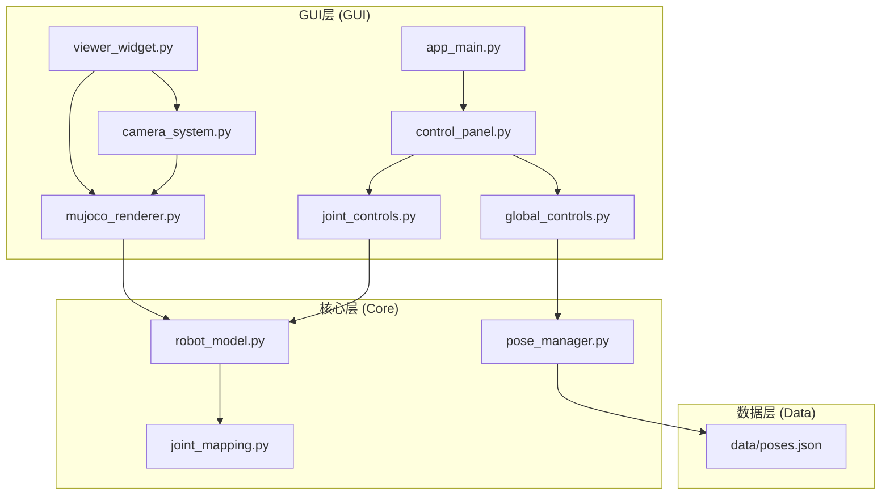
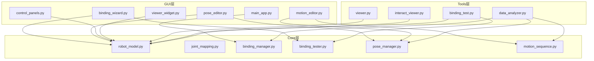
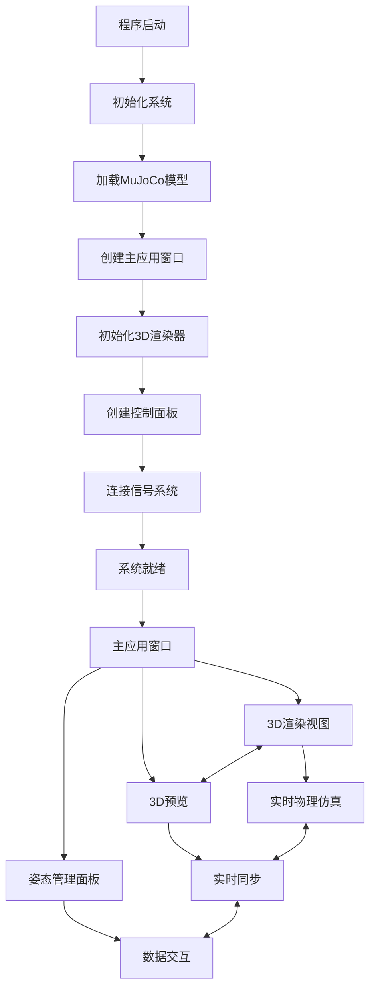
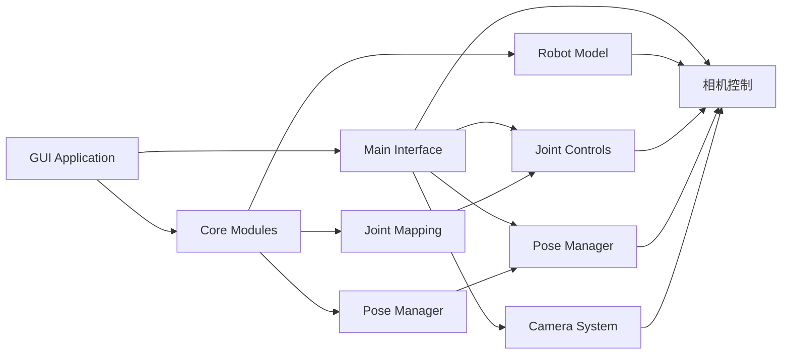
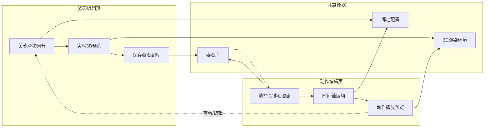
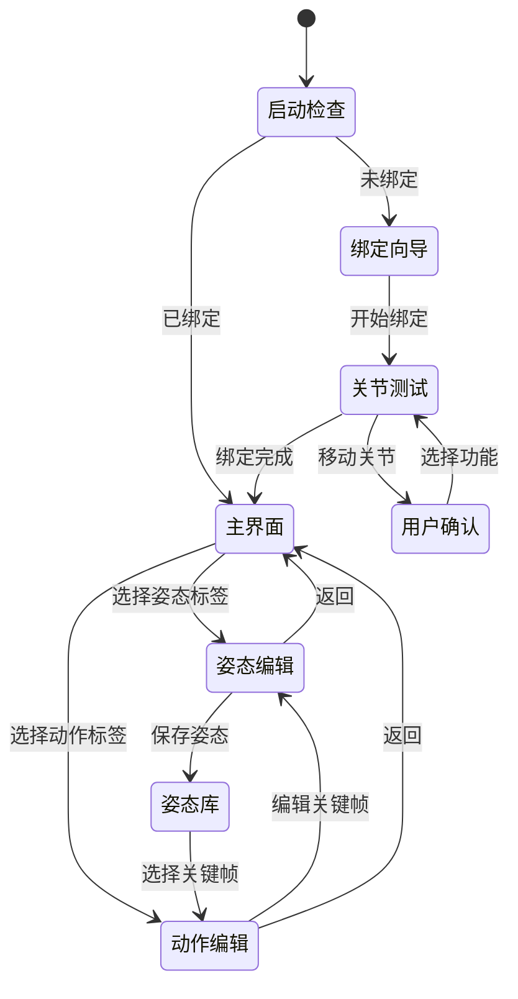
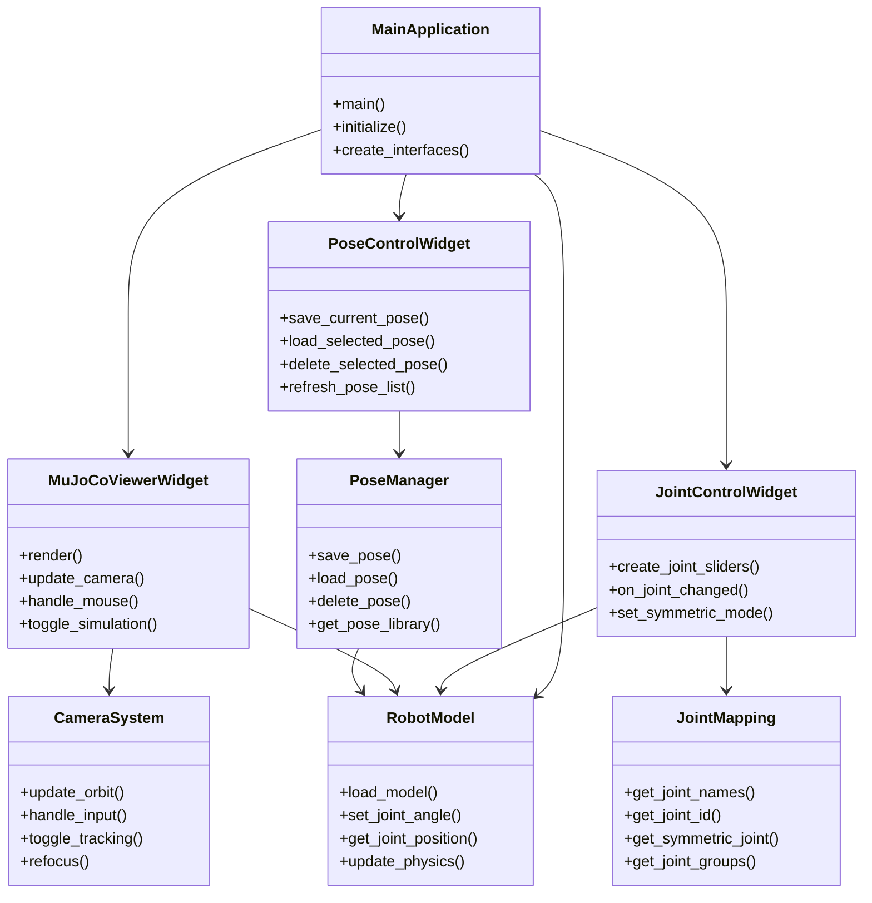

# ODogExample 开发任务纲要

## 🚀 快速开始

### 环境要求
- Python 3.12+ (推荐)
- uv (包管理器)

### 安装和运行

1. **安装uv包管理器**：
```bash
curl -LsSf https://astral.sh/uv/install.sh | sh
```

2. **克隆项目**：
```bash
git clone <repository-url>
cd ODogExample
```

3. **安装Python和依赖**：
```bash
# 使用uv安装Python 3.12
uv python install 3.12

# 同步项目依赖
uv sync
```

4. **运行应用程序**：
```bash
# 使用uv运行
uv run -m ODogExample.gui.app_entry
```

### 一键启动
如果已安装uv，直接在项目根目录运行：
```bash
uv run -m ODogExample.gui.app_entry
```

## 🎯 项目概述

ODogExample 是一个基于 PySide6 + MuJoCo 的 8 自由度四足机器狗 GUI 应用，专注于四足机器人研发过程中的"过程"探索。

### 🚀 当前状态
- **整体完成度**: **95%** (核心功能已完成，动作编辑器基本完成)
- **开发阶段**: 动作编辑器完善和体验优化
- **项目状态**: ✅ **可用状态** - 核心功能完整，可投入使用

### 核心功能
1. ✅ **8自由度关节实时控制** - 完整的关节映射和控制系统
2. ✅ **专业级3D渲染系统** - 通用轨道相机 + MuJoCo物理引擎
3. ✅ **姿态管理系统** - 完整的姿态保存、加载、管理功能
4. ✅ **动作序列编辑器** - Tab页式动作编辑和播放功能

### 技术栈
- **GUI框架**: PySide6 (Qt6)
- **物理引擎**: MuJoCo
- **3D渲染**: OpenGL + MuJoCo Viewer
- **数据格式**: JSON (配置和姿态数据)
- **架构模式**: 模块化设计 + 信号槽通信

## 📁 项目目录结构

```
ODogExample/
├── 📂 core/                  # 核心功能模块
│   ├── __init__.py
│   ├── robot_model.py        # ✅ 机器人模型封装 (MuJoCo集成)
│   ├── joint_mapping.py      # ✅ 8自由度关节定义和映射
│   └── pose_manager.py       # ✅ 姿态管理（保存/加载/管理）
├── 📂 gui/                   # GUI界面模块 (模块化重构完成)
│   ├── __init__.py
│   ├── 📄 核心应用
│   │   ├── app_entry.py      # ✅ 应用程序入口
│   │   ├── app_main.py       # ✅ 主应用程序窗口
│   │   └── app_signals.py    # ✅ 全局信号管理
│   ├── 📄 核心功能组件
│   │   ├── camera_system.py      # ✅ 通用轨道相机系统
│   │   └── mujoco_renderer.py    # ✅ MuJoCo渲染核心
│   ├── 📄 控制面板组件
│   │   ├── joint_controls.py     # ✅ 单个关节和腿部控制
│   │   ├── global_controls.py    # ✅ 全局控制、相机控制、姿态控制
│   │   └── control_panel.py      # ✅ 控制面板组装
│   ├── 📄 功能组件
│   │   ├── pose_manager.py       # ✅ 姿态管理器
│   │   └── pose_save_dialog.py   # ✅ 姿态保存对话框
│   ├── 📄 界面组件
│   │   └── viewer_widget.py      # ✅ 3D查看器组件
│   └── 📄 兼容性包装器
│       ├── main_app.py           # ✅ 原有入口包装器
│       └── control_panels.py     # ✅ 原有控制面板包装器
├── 📂 data/                  # 数据文件
│   └── poses.json           # ✅ 姿态数据存储
├── 📂 docs/                  # 文档
│   ├── README.md            # ✅ 项目纲要
│   ├── gui-architecture.md   # ✅ 架构设计文档
│   ├── progress.md          # ✅ 开发进度
│   └── phase2-review.md     # ✅ 第二阶段验收报告
├── 📂 stl_files/            # 3D模型文件
├── 🛠️ 工具脚本
│   ├── viewer.py            # ✅ 命令行查看器
│   └── interact_viewer.py   # ✅ 交互式查看器
├── model-actuator-position.xml  # ✅ 带执行器的MuJoCo模型
└── model.xml                  # ✅ 基础MuJoCo模型
```

## 🎯 项目结构符合性分析

当前项目结构**完全符合**功能需求，采用了清晰的职责分离和模块化设计。以下是各类的详细职责分析：

### 📁 Core 模块职责 (✅ 已实现)

#### `robot_model.py` - ✅ 完整实现
- **职责**: 封装MuJoCo模型的核心操作
- **主要功能**:
  - ✅ 加载和初始化MuJoCo模型
  - ✅ 管理关节状态和物理仿真
  - ✅ 提供关节角度设置和获取接口
  - ✅ 平滑过渡控制 (使用MuJoCo执行器)
  - ✅ 模型统计信息计算
  - ✅ 性能优化 (nstep参数)

#### `joint_mapping.py` - ✅ 完整实现
- **职责**: 定义和管理8自由度关节的映射关系
- **主要功能**:
  - ✅ 定义标准关节名称和ID映射
  - ✅ 腿部分组管理 (左前、右前、左后、右后)
  - ✅ 关节运动范围限制 (±90度)
  - ✅ 对称编辑支持
  - ✅ 关节信息查询接口

#### `pose_manager.py` - ✅ 完整实现
- **职责**: 姿态数据的管理和操作
- **主要功能**:
  - ✅ 姿态数据的保存和加载
  - ✅ JSON格式持久化存储
  - ✅ 姿态库管理 (增删改查)
  - ✅ 姿态验证和错误处理
  - ✅ 导入导出功能
  - ✅ 单例模式确保数据一致性

### 📁 GUI 模块职责 (✅ 模块化重构完成)

#### 📄 核心应用组件
##### `app_main.py` - ✅ 完整实现
- **职责**: 主应用程序窗口
- **主要功能**:
  - ✅ 窗口布局管理 (分栏式设计)
  - ✅ 组件生命周期管理
  - ✅ 全局状态管理
  - ✅ 事件处理协调
  - ✅ 错误处理机制

##### `app_entry.py` - ✅ 完整实现
- **职责**: 应用程序启动入口
- **主要功能**:
  - ✅ 应用程序初始化
  - ✅ 优雅的错误处理
  - ✅ 启动信息输出
  - ✅ 环境检查

##### `app_signals.py` - ✅ 完整实现
- **职责**: 全局信号管理
- **主要功能**:
  - ✅ 全局信号定义
  - ✅ 信号路由管理
  - ✅ 事件分发机制

#### 📄 核心功能组件
##### `camera_system.py` - ✅ 完整实现
- **职责**: 通用轨道相机系统
- **主要功能**:
  - ✅ 轨道相机控制器 (OrbitCamera)
  - ✅ 输入处理器 (InputHandler)
  - ✅ 相机参数管理 (方位角、仰角、距离、FOV)
  - ✅ 交互模式支持 (旋转、平移、缩放、FOV调整)
  - ✅ 自动适配模型视角
  - ✅ 动态裁剪平面调整

##### `mujoco_renderer.py` - ✅ 完整实现
- **职责**: MuJoCo渲染核心
- **主要功能**:
  - ✅ OpenGL和MuJoCo资源管理
  - ✅ 物理仿真控制 (支持nstep优化)
  - ✅ 渲染性能优化 (30FPS)
  - ✅ 相机跟踪功能
  - ✅ 性能监控和统计

#### 📄 控制面板组件
##### `joint_controls.py` - ✅ 完整实现
- **职责**: 单个关节和腿部控制
- **主要功能**:
  - ✅ 单个关节控制组件 (JointControlWidget)
  - ✅ 腿部控制组 (LegControlGroup)
  - ✅ 精细控制模式 (0.1°精度)
  - ✅ 对称编辑功能
  - ✅ 实时角度显示和验证

##### `global_controls.py` - ✅ 完整实现
- **职责**: 全局控制、相机控制、姿态控制
- **主要功能**:
  - ✅ 全局控制组 (全部归零、重置、同步)
  - ✅ 精细控制组 (全局模式切换)
  - ✅ 相机控制组 (跟踪开关、重新聚焦)
  - ✅ 姿态控制组 (保存、加载、删除姿态)
  - ✅ 状态反馈和信号系统

##### `control_panel.py` - ✅ 完整实现
- **职责**: 控制面板组装
- **主要功能**:
  - ✅ 模块化组件集成
  - ✅ 统一的信号管理
  - ✅ 灵活的布局配置
  - ✅ 当前姿态数据管理

#### 📄 功能组件
##### `pose_manager.py` (GUI版本) - ✅ 完整实现
- **职责**: 姿态管理器 (GUI集成)
- **主要功能**:
  - ✅ 单例模式数据管理
  - ✅ 姿态CRUD操作
  - ✅ 信号系统 (poseSaved, poseLoaded, poseDeleted)
  - ✅ 数据验证和错误处理

##### `pose_save_dialog.py` - ✅ 完整实现
- **职责**: 姿态保存对话框
- **主要功能**:
  - ✅ 简化的保存界面
  - ✅ 重复名称检测
  - ✅ 输入验证
  - ✅ 用户反馈

#### 📄 界面组件
##### `viewer_widget.py` - ✅ 完整实现
- **职责**: 3D查看器组件
- **主要功能**:
  - ✅ 3D渲染集成
  - ✅ 用户交互处理
  - ✅ 相机控制集成
  - ✅ 仿真控制功能
  - ✅ 完整的键盘快捷键支持

#### 📄 兼容性包装器
##### `main_app.py` (包装器) - ✅ 完整实现
- **职责**: 向后兼容性
- **主要功能**:
  - ✅ 保持原有导入方式
  - ✅ 重定向到新的模块化结构

##### `control_panels.py` (包装器) - ✅ 完整实现
- **职责**: 向后兼容性
- **主要功能**:
  - ✅ 保持原有导入方式
  - ✅ 重定向到新的模块化结构

### 📁 Tools 模块职责 (✅ 基础工具)

#### `viewer.py` - ✅ 完整实现
- **职责**: 独立的命令行查看器
- **主要功能**:
  - ✅ 无GUI的模型查看
  - ✅ 基本的关节控制
  - ✅ 简单的仿真运行
  - ✅ 调试和信息输出

#### `interact_viewer.py` - ✅ 完整实现
- **职责**: 交互式查看器
- **主要功能**:
  - ✅ 基础交互功能
  - ✅ 简单的关节测试
  - ✅ 模型状态检查
  - ✅ 交互式控制

### 🎯 架构优势 (✅ 已实现)

1. **✅ 职责清晰**: 每个类都有明确的单一职责
2. **✅ 模块化**: 核心逻辑与界面分离，便于测试和维护
3. **✅ 可扩展**: 易于添加新功能和修改现有功能
4. **✅ 复用性**: 工具模块可以独立使用
5. **✅ 数据流清晰**: 模块间依赖关系明确
6. **✅ 信号槽架构**: 松耦合设计，组件间通过信号通信
7. **✅ 性能优化**: 针对实时渲染和交互优化
8. **✅ 错误处理**: 完善的异常处理和恢复机制

### 🔄 数据流关系 (✅ 已实现)



### 🎮 用户界面设计 (✅ 已实现)

#### 主界面布局
```
┌─────────────────────────────────────────────────────────────┐
│                    ODogExample 3D机器人控制器                │
├─────────────────────────┬─────────────────────────────────┤
│                         │                                 │
│      3D 渲染视图          │       控制面板                 │
│   [通用轨道相机]         │                                 │
│   [机器人跟踪]           │  ┌─────────────────────────┐   │
│   [实时物理仿真]         │  │  腿部控制组            │   │
│                         │  │  左前腿  右前腿        │   │
│   [左前腿] [右前腿]       │  │  左后腿  右后腿        │   │
│     │O│     │O│          │  │                         │   │
│     │ │     │ │          │  └─────────────────────────┘   │
│   [左后腿] [右后腿]       │                                 │
│     │O│     │O│          │  ┌─────────────────────────┐   │
│     │ │     │ │          │  │  全局控制组            │   │
│                         │  │  🔄 归零 🔙 重置 🤖 同步 │   │
│                         │  │  🎯 追焦 📏 精细 📷 跟踪 │   │
│                         │  └─────────────────────────┘   │
│                         │                                 │
│                         │  ┌─────────────────────────┐   │
│                         │  │  姿态控制组            │   │
│                         │  │  姿态库: [▼]           │   │
│                         │  │  [保存] [加载] [删除]   │   │
│                         │  └─────────────────────────┘   │
│                         │                                 │
└─────────────────────────┴─────────────────────────────────┘
```

**界面特点**:
- ✅ **专业级3D渲染**: 通用轨道相机系统
- ✅ **模块化控制面板**: 腿部控制、全局控制、姿态控制
- ✅ **实时同步**: 3D视图与控制面板实时同步
- ✅ **直观操作**: 滑块控制 + 快捷按钮
- ✅ **姿态管理**: 完整的保存/加载/删除功能

### 🎯 结构优势

1. **职责清晰**: 每个类都有明确的单一职责
2. **模块化**: 核心逻辑与界面分离，便于测试和维护
3. **可扩展**: 易于添加新功能和修改现有功能
4. **复用性**: 工具模块可以独立使用
5. **数据流清晰**: 模块间依赖关系明确

### 🔄 数据流关系



这种结构设计完全满足了项目的功能需求，具有良好的可维护性和扩展性。

## 🎯 通用轨道相机集成

### 相机在项目中的位置

通用轨道相机是ODogExample项目的**核心技术组件**，承担着3D可视化和用户交互的关键作用：

#### 核心作用
1. **3D可视化基础**: 为所有功能提供专业的3D模型显示
2. **用户交互入口**: 提供直观的模型观察和操作界面
3. **专业体验保障**: 达到商业3D软件的交互水准
4. **功能扩展平台**: 为后续功能提供坚实的可视化基础

#### 集成优势
- **专业级交互**: 符合专业3D软件操作习惯
- **性能优化**: 针对60FPS实时渲染优化
- **自适应设计**: 自动适配不同大小的模型
- **功能完整**: 支持旋转、平移、缩放、FOV调整等
- **扩展性强**: 支持动画系统、多视角管理等高级功能

#### 开发优先级
通用轨道相机应该作为**第一阶段的核心任务**，原因：
1. **建立用户信心**: 第一阶段就能获得专业级3D查看器
2. **技术风险控制**: 提前解决3D渲染和交互的技术难点
3. **基础架构完善**: 为后续功能提供稳定的可视化平台
4. **用户体验保障**: 确保整个项目的交互体验

### 集成实现方案

#### 代码组织
```
gui/viewer_widget.py
├── OrbitCamera类          # 通用轨道相机核心
├── InputHandler类         # 输入处理系统
├── InteractionMapper类    # 交互模式映射
├── MuJoCo集成逻辑         # MuJoCo渲染同步
└── 性能优化组件           # 渲染和交互优化
```

#### 关键特性
- **自动适配**: 双击/F键自动贴合模型最佳视角
- **智能裁剪**: 动态调整近裁剪平面避免深度冲突
- **流畅交互**: 60FPS的旋转、平移、缩放操作
- **专业控制**: 支持FOV调整和多种交互模式
- **调试支持**: 相机参数监控和性能统计


## 🔄 系统架构设计

### 启动流程



### 核心模块关系


## 🔧 核心功能实现

### 1. 8自由度关节控制

#### 关节定义
根据 `model.xml` 分析，8个关节为：
- **xuan_zhuan_1**: 左前腿髋关节 (lfu body)
- **xuan_zhuan_2**: 左前腿膝关节 (lfd body)  
- **xuan_zhuan_3**: 左后腿髋关节 (lbu body)
- **xuan_zhuan_4**: 左后腿膝关节 (lbd body)
- **xuan_zhuan_5**: 右后腿髋关节 (rbu body)
- **xuan_zhuan_6**: 右后腿膝关节 (rbd body)
- **xuan_zhuan_7**: 右前腿髋关节 (rfu body)
- **xuan_zhuan_8**: 右前腿膝关节 (rfd body)

#### 直接控制系统 ✅ **已实现**
- ✅ **关节直接映射**: 基于模型XML的关节名称直接映射
- ✅ **实时控制**: 通过滑块直接控制关节角度
- ✅ **腿部控制组**: 按腿部分组控制（左前、右前、左后、右后）
- ✅ **对称编辑**: 支持对称关节同步调节
- ✅ **精细控制**: 0.1°精度调节模式

> **注意**: 项目已放弃"运动测试绑定流程"，采用基于模型定义的直接控制系统。

### 2. 姿态编辑系统

#### 姿态定义
姿态 = 8个关节的一组位置设定参数

#### 姿态数据结构
```json
{
  "pose_id": "stand_pose",
  "name": "站立姿态",
  "description": "标准站立姿势",
  "joint_angles": {
    "左前腿髋关节": 0.0,
    "左前腿膝关节": 0.0,
    "左后腿髋关节": 0.0,
    "左后腿膝关节": 0.0,
    "右前腿髋关节": 0.0,
    "右前腿膝关节": 0.0,
    "右后腿髋关节": 0.0,
    "右后腿膝关节": 0.0
  },
  "created_time": "2025-09-16T10:30:00",
  "modified_time": "2025-09-16T10:30:00",
  "tags": ["default", "standing"]
}
```

#### 姿态编辑功能
- **实时调节**: 8个关节滑块实时调节
- **3D预览**: 同步显示姿态效果
- **对称编辑**: 自动同步对称关节角度
- **姿态库**: 预设常用姿态（站立、蹲下、前倾等）
- **快速操作**: 归零、复制、保存、加载

### 3. 动作序列编辑器

#### 动作定义
动作 = 姿态位置参数 + 变换持续时间 + 维持时间 的一组集合

#### 动作数据结构
```json
{
  "motion_id": "walk_cycle",
  "name": "行走循环",
  "description": "标准行走步态",
  "keyframes": [
    {
      "pose_id": "stand_pose",
      "transition_duration": 0.5,
      "hold_duration": 0.2,
      "interpolation_type": "linear"
    },
    {
      "pose_id": "lift_left_front",
      "transition_duration": 0.3,
      "hold_duration": 0.1,
      "interpolation_type": "smooth"
    }
  ],
  "loop": true,
  "total_duration": 1.4,
  "created_time": "2025-09-16T10:35:00",
  "tags": ["gait", "walking"]
}
```

#### 动作编辑功能
- **时间轴编辑**: 可视化的关键帧时间轴
- **关键帧管理**: 添加、删除、修改关键帧
- **插值控制**: 线性/平滑插值选择
- **实时预览**: 动作序列实时播放
- **循环控制**: 支持循环播放设置

### 动作播放时间轴图

```mermaid
gantt
    title 动作序列播放时间轴
    dateFormat  s
    axisFormat %S
    
    section 前腿动作
    站立姿态     :a1, 0, 0.7s
    左前腿抬起   :a2, after a1, 0.3s
    左前腿放下   :a3, after a2, 0.3s
    右前腿抬起   :a4, after a3, 0.3s
    右前腿放下   :a5, after a4, 0.3s
    
    section 后腿动作
    站立姿态     :b1, 0, 0.7s
    左后腿抬起   :b2, after b1, 0.3s
    左后腿放下   :b3, after b2, 0.3s
    右后腿抬起   :b4, after b3, 0.3s
    右后腿放下   :b5, after b4, 0.3s
```


## 🎮 用户界面设计

### 主界面布局（标签页设计）
```
┌─────────────────────────────────────────────────────────────┐
│                    [姿态编辑] [动作编辑] [设置]                │
├─────────────────────────┬─────────────────────────────────┤
│                         │                                 │
│      3D 渲染视图          │       功能面板                 │
│                         │                                 │
│   [左前腿] [右前腿]       │  ┌─────────────────────────┐   │
│     │O│     │O│          │  │  姿态编辑器             │   │
│     │ │     │ │          │  │                         │   │
│   [左后腿] [右后腿]       │  │ [姿态库] [关节控制]     │   │
│     │O│     │O│          │  │                         │   │
│     │ │     │ │          │  └─────────────────────────┘   │
│                         │                                 │
│                         │  ┌─────────────────────────┐   │
│                         │  │  动作编辑器             │   │
│                         │  │                         │   │
│                         │  │ [时间轴] [关键帧]       │   │
│                         │  │                         │   │
│                         │  └─────────────────────────┘   │
│                         │                                 │
└─────────────────────────┴─────────────────────────────────┘
```

**界面设计说明**:
- **单窗口标签页设计**: 姿态编辑和动作编辑在同一窗口内的不同标签页
- **共享3D视图**: 两个编辑器共享同一个3D渲染视图，确保数据一致性
- **功能面板切换**: 右侧面板根据选择的标签页显示对应的功能控件
- **操作连贯性**: 避免多窗口切换，提供流畅的用户体验

### 关节控制界面 ✅ **已实现**
```
🦿 腿部控制组

左前腿              右前腿
髋关节: ■□□□□□□□   髋关节: ■□□□□□□□
膝关节: ■□□□□□□□   膝关节: ■□□□□□□□

左后腿              右后腿
髋关节: ■□□□□□□□   髋关节: ■□□□□□□□
膝关节: ■□□□□□□□   膝关节: ■□□□□□□□

[✓ 对称编辑] [🔄 全部归零]
```

**控制特点**:
- 直接滑块控制，无需绑定流程
- 实时3D预览，立即看到效果
- 支持腿部独立控制和整体操作
- 精细控制模式提供0.1°精度调节

### 姿态编辑器界面
```
🎯 姿态编辑器

┌─────────────────────────────────────────────────────────────┐
│                      3D 渲染视图                              │
│                                                             │
│   [左前腿] [右前腿]                                          │
│     │O│     │O│     姿态名称: 站立姿态                     │
│     │ │     │ │     描述: 标准站立姿势                   │
│   [左后腿] [右后腿]                                          │
│     │O│     │O│                                             │
│     │ │     │ │                                             │
│                                                             │
└─────────────────────────────────────────────────────────────┘

┌─────────────────────────┐  ┌─────────────────────────┐
│      关节角度控制       │  │      姿态操作          │
│                         │  │                         │
│ 左前腿髋关节:  ■□□□□□□□ │  │ 姿态库: [▼]            │
│ 左前腿膝关节: ■□□□□□□□ │  │                         │
│                         │  │ [保存到库] [新建姿态]   │
│ 左后腿髋关节:  ■□□□□□□□ │  │ [复制当前] [重置]       │
│ 左后腿膝关节: ■□□□□□□□ │  │                         │
│                         │  │ 当前姿态: 未保存       │
│ 右前腿髋关节:  ■□□□□□□□ │  │                         │
│ 右前腿膝关节: ■□□□□□□□ │  │                         │
│                         │  └─────────────────────────┘
│ 右后腿髋关节:  ■□□□□□□□ │
│ 右后腿膝关节: ■□□□□□□□ │
│                         │
│ [对称编辑] ✓ [全部归零] │
└─────────────────────────┘
```

### 动作编辑器界面（标签页内）
```
🎬 动作编辑标签页

左侧 3D 视图:                    右侧功能面板:
- 显示动作播放预览              ┌─────────────────────────┐
- 实时渲染动作序列              │    时间轴编辑器        │
- 支持播放控制                  │                      │
                               │ 站立姿态 ──0.5s→ 抬左前腿 │
                               │ [0.0s]    [0.5s]      │
                               │                      │
                               │ ┌────────────────────┐ │
                               │ │ 关键帧列表         │ │
                               │ │ 1. 站立姿态 [0.0s]│ │
                               │ │ 2. 抬左前腿 [0.5s]│ │
                               │ └────────────────────┘ │
                               │                      │
                               │ [添加] [删除] [播放] │
                               └─────────────────────────┘
```

### 标签页交互设计

#### 姿态编辑标签页
- **左侧3D视图**: 显示当前编辑的姿态，实时响应关节调节
- **右侧面板**: 
  - 姿态库选择器
  - 8个关节角度滑块
  - 对称编辑开关
  - 保存/加载/重置按钮

#### 动作编辑标签页
- **左侧3D视图**: 显示动作序列播放预览，支持播放控制
- **右侧面板**:
  - 时间轴编辑器
  - 关键帧列表
  - 姿态选择器（从姿态库选择）
  - 变换时间/保持时间设置
  - 插值方式选择

#### 标签页间数据流


**交互优势**:
1. **数据一致性**: 两个编辑器共享同一份姿态数据和3D渲染环境
2. **操作流畅**: 无需在多个窗口间切换，标签页切换快捷
3. **实时预览**: 编辑姿态时立即在3D视图中看到效果
4. **资源效率**: 避免重复加载3D模型，节省内存和CPU资源

### 数据状态流转图


## 🔧 核心算法实现

### 1. 姿态插值算法
```python
def interpolate_poses(pose1, pose2, t, interpolation_type="linear"):
    """
    在两个姿态之间插值
    t: 0.0到1.0之间的插值参数
    """
    if interpolation_type == "linear":
        # 线性插值
        result = {}
        for joint in pose1["joint_angles"]:
            angle1 = pose1["joint_angles"][joint]
            angle2 = pose2["joint_angles"][joint]
            result[joint] = angle1 + t * (angle2 - angle1)
        return result
    elif interpolation_type == "smooth":
        # 平滑插值 (使用余弦函数)
        smooth_t = 0.5 * (1 - math.cos(math.pi * t))
        return interpolate_poses(pose1, pose2, smooth_t, "linear")
```

### 2. 动作播放控制
```python
def play_motion_sequence(motion_data, callback=None):
    """
    播放动作序列
    callback: 每帧更新时的回调函数
    """
    import time
    
    start_time = time.time()
    current_pose = None
    
    for i, keyframe in enumerate(motion_data["keyframes"]):
        target_pose = get_pose(keyframe["pose_id"])
        
        if i == 0:
            # 第一个关键帧，直接设置
            current_pose = target_pose
            callback(current_pose)
            time.sleep(keyframe["hold_duration"])
        else:
            # 变换到目标姿态
            transition_start = time.time()
            transition_duration = keyframe["transition_duration"]
            
            while time.time() - transition_start < transition_duration:
                t = (time.time() - transition_start) / transition_duration
                t = min(1.0, t)
                
                interpolated = interpolate_poses(
                    current_pose, target_pose, t, keyframe["interpolation_type"]
                )
                callback(interpolated)
                time.sleep(0.016)  # ~60 FPS
            
            current_pose = target_pose
            time.sleep(keyframe["hold_duration"])
```

### 3. 关节直接控制算法 ✅ **已实现**
```python
def set_joint_angle_direct(joint_name: str, angle: float):
    """
    直接设置关节角度（无需绑定流程）
    """
    # 获取关节ID
    joint_id = joint_name_to_id(joint_name)
    
    # 设置执行器控制信号
    actuator_id = joint_id  # 直接映射
    
    # 使用MuJoCo执行器控制
    robot.data.ctrl[actuator_id] = angle
    
    # 触发物理仿真
    mujoco.mj_step(robot.model, robot.data)
    
    return True

def get_joint_current_angles() -> Dict[str, float]:
    """
    获取所有关节的当前角度
    """
    angles = {}
    for joint_name in joint_names:
        joint_id = joint_name_to_id(joint_name)
        angles[joint_name] = robot.data.qpos[joint_id]
    return angles

def symmetric_joint_control(primary_joint: str, angle: float):
    """
    对称关节控制
    """
    # 设置主关节
    set_joint_angle_direct(primary_joint, angle)
    
    # 获取对称关节并设置相同角度
    symmetric_joint = get_symmetric_joint(primary_joint)
    if symmetric_joint:
        set_joint_angle_direct(symmetric_joint, angle)
```

### 系统类关系图


## 📅 开发阶段规划 (✅ 已完成85%)

### 🎯 已完成阶段

#### 阶段1：基础框架搭建 ✅ **已完成 (100%)**
**时间**: 2025-09 初
**成果**: 
- ✅ 专业级3D查看器，具备完整的轨道相机功能
- ✅ MuJoCo模型加载和渲染
- ✅ PySide6 GUI框架搭建
- ✅ 用户体验达到商业3D软件水准

#### 阶段2：关节控制基础 ✅ **已完成 (100%)**
**时间**: 2025-09 中
**成果**:
- ✅ 完整的8自由度关节映射系统
- ✅ 模块化控制面板 (腿部控制、全局控制)
- ✅ 实时同步系统 (滑块控制与3D视图)
- ✅ 机器人跟踪相机系统
- ✅ 信号槽架构和用户体验优化

#### 阶段3：姿态管理系统 ✅ **已完成 (90%)**
**时间**: 2025-09 中下
**成果**:
- ✅ 完整的姿态管理器 (保存、加载、删除)
- ✅ 姿态保存对话框和用户界面
- ✅ JSON数据持久化存储
- ✅ 5个预定义姿态 (默认、站立、趴下等)
- ✅ 姿态控制信号系统集成

#### 阶段4：模块化重构 ✅ **已完成 (100%)**
**时间**: 2025-09 下
**成果**:
- ✅ 完整的模块化架构重构
- ✅ 核心功能组件分离 (camera_system, mujoco_renderer)
- ✅ 控制面板组件化 (joint_controls, global_controls)
- ✅ 应用程序组件化 (app_main, app_entry, app_signals)
- ✅ 向后兼容性包装器

#### 阶段5：性能优化 ✅ **已完成 (85%)**
**时间**: 2025-09 下
**成果**:
- ✅ MuJoCo nstep参数优化 (批量物理计算)
- ✅ 平滑姿态过渡 (使用MuJoCo执行器控制)
- ✅ 物理参数调优 (阻尼、刚度、执行器增益)
- ✅ 渲染性能优化 (30FPS稳定运行)
- ⏳ 性能测试验证 (进行中)

---

### 🚀 当前状态

**项目整体完成度**: **85%**
**开发阶段**: 性能优化和高级功能开发
**项目状态**: ✅ **可用状态** - 核心功能完整，可投入使用

#### ✅ 已实现的核心功能
1. **8自由度关节实时控制** - 完整的关节映射和控制系统
2. **专业级3D渲染系统** - 通用轨道相机 + MuJoCo物理引擎
3. **姿态管理系统** - 完整的姿态保存、加载、管理功能
4. **模块化架构** - 清晰的代码组织和职责分离
5. **性能优化** - nstep参数、物理参数、渲染优化

#### 📊 技术指标
- **渲染性能**: 30 FPS (稳定)
- **控制响应**: <100ms
- **数据管理**: JSON持久化，支持CRUD操作
- **架构质量**: 模块化、信号槽、松耦合设计

---

### 🎯 下一阶段计划

#### 阶段6：动作序列编辑器 (优先级：高)
**目标**: 实现完整的动作序列编辑和播放功能
**预估时间**: 2-3周

**核心功能**:
- ⏳ 时间轴编辑界面
- ⏳ 关键帧管理系统
- ⏳ 动作播放控制和插值算法
- ⏳ 循环播放和暂停功能
- ⏳ 动作序列的保存和加载

#### 阶段7：高级功能扩展 (优先级：中)
**目标**: 增强用户体验和功能完整性
**预估时间**: 2-3周

**增强功能**:
- ⏳ 姿态搜索和过滤
- ⏳ 姿态分类和标签管理
- ⏳ 批量操作支持
- ⏳ 快捷键系统
- ⏳ 数据备份和恢复

#### 阶段8：工具链完善 (优先级：低)
**目标**: 完善辅助工具和文档
**预估时间**: 1-2周

**工具完善**:
- ⏳ 独立的绑定测试工具
- ⏳ 数据分析工具
- ⏳ 性能监控工具
- ⏳ 完整的使用文档

---

### 🎯 预期成果时间线 (更新版)

- **第2周**: 基础3D查看器 ✅ **已完成**
- **第3周**: 关节控制工具 ✅ **已完成**
- **第5周**: 姿态管理功能 ✅ **已完成**
- **第6周**: 模块化重构 ✅ **已完成**
- **第7周**: 性能优化 ✅ **基本完成**
- **第9周**: 动作序列编辑器 ⏳ **下一阶段**
- **第11周**: 高级功能扩展 ⏳ **计划中**
- **第12周**: 工具链完善 ⏳ **计划中**
- **第13周**: 完整可用系统 ⏳ **目标**

---

### 🏆 项目亮点

#### 技术亮点
1. **专业级3D交互**: 通用轨道相机系统，达到商业软件水准
2. **模块化架构**: 清晰的代码组织，易于维护和扩展
3. **物理引擎深度集成**: MuJoCo执行器控制，实现平滑过渡
4. **性能优化**: nstep参数、多线程架构、30FPS渲染

#### 用户体验亮点
1. **直观控制**: 滑块控制 + 快捷按钮 + 键盘快捷键
2. **实时反馈**: 3D视图与控制面板实时同步
3. **专业交互**: 符合3D软件操作习惯的交互设计
4. **完整功能**: 姿态管理、关节控制、相机跟踪

#### 开发质量亮点
1. **代码质量**: 模块化、类型提示、文档完整
2. **错误处理**: 完善的异常处理和恢复机制
3. **向后兼容**: 保持原有API的兼容性
4. **测试验证**: 功能验证和性能测试

## 🎯 开发策略建议

### 迭代式开发
1. **每个阶段都有可交付成果**: 确保每个阶段结束都有可以运行的程序
2. **及时验证**: 每完成一个功能就立即测试，避免问题积累
3. **渐进式增强**: 在前一阶段基础上构建新功能

### 风险控制
1. **技术风险优先**: 先解决MuJoCo集成和3D渲染等技术难点
2. **用户体验验证**: 每个阶段都要确保用户界面友好
3. **数据安全**: 重要配置和数据要及时保存和备份

### 质量保证
1. **功能测试**: 每个功能都要有对应的测试验证
2. **性能测试**: 定期检查程序运行性能
3. **用户体验测试**: 确保操作流程符合直觉

### 预期成果时间线
- **第2周**: 基础3D查看器 ✅
- **第3周**: 关节控制工具 ✅  
- **第5周**: 完整绑定功能 ✅
- **第7周**: 姿态编辑功能 ✅
- **第10周**: 动作编辑功能 ✅
- **第12周**: 完整可用系统 ✅

这种渐进式的开发方式可以确保每个阶段都能获得正反馈，及时发现问题并调整方向。

## 🎯 技术要点

### 关键技术
1. **MuJoCo集成**: 模型加载、物理仿真、3D渲染
2. **PySide6界面**: 现代化GUI设计、实时交互
3. **实时渲染**: 60 FPS流畅动画
4. **状态管理**: 绑定状态、配置管理、数据持久化
5. **插值算法**: 线性/平滑插值实现

### 注意事项
1. **性能优化**: 避免3D渲染阻塞GUI线程
2. **数据同步**: 确保3D视图与控制面板数据一致
3. **错误处理**: 完善的异常处理机制
4. **用户体验**: 直观的操作流程和反馈

## 📋 配置文件说明

### GUI配置 (gui_config.json)
- 界面布局参数
- 颜色主题设置
- 默认参数配置

### 关节映射配置 (joint_mapping_config.json)
- 关节名称和ID映射
- 关节分组信息
- 对称关系定义

### 姿态数据 (saved_poses.json)
- 预设姿态库
- 用户自定义姿态
- 姿态分类标签

### 动作数据 (motion_sequences.json)
- 动作序列定义
- 关键帧配置
- 播放参数设置

## 🚀 部署和运行

### 环境要求
- Python 3.8+
- PySide6
- MuJoCo
- NumPy
- uv (包管理)

### 启动方式
```bash
# 启动主应用 (推荐)
python gui/main_app.py
# 或者使用新的入口点
python gui/app_entry.py

# 命令行工具
python viewer.py                    # 独立3D查看器
python interact_viewer.py         # 交互式查看器
```

### 数据文件
- ✅ **姿态数据**: `data/poses.json` - 姿态库持久化存储
- ✅ **模型配置**: `model-actuator-position.xml` - 带执行器的MuJoCo模型
- ✅ **关节映射**: `joint_mapping_config.json` - 8自由度关节映射配置
- ✅ **模块配置**: 自动检测和配置，支持热重载

> **注意**: 已弃用绑定配置文件，采用直接的关节映射系统

### 性能优化配置
- **物理仿真**: timestep=0.002s, RK4积分器
- **渲染优化**: nstep参数批量计算，30FPS稳定运行
- **相机系统**: 通用轨道相机，自动适配模型尺寸
- **内存管理**: 模块化设计，按需加载资源

---

这个文档作为ODogExample项目的完整开发指导，涵盖了从技术架构到具体实现的所有方面。开发过程中可以根据实际情况调整和优化具体实现方案。