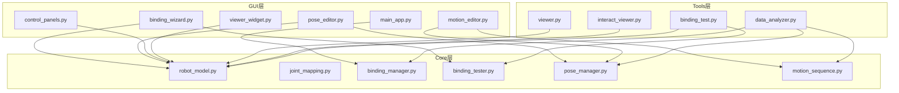
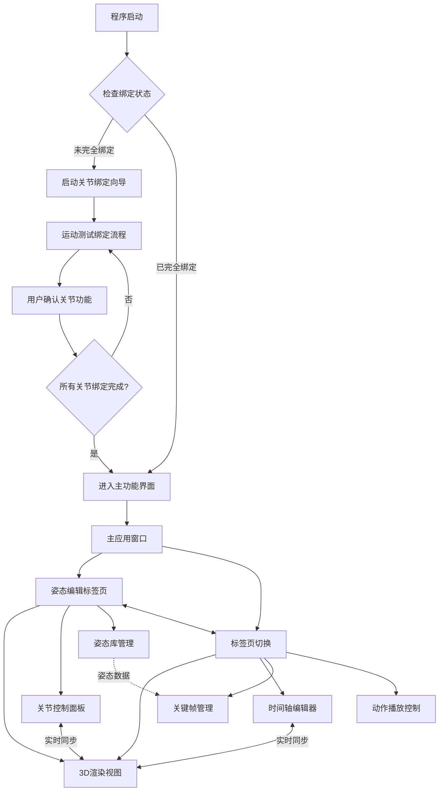
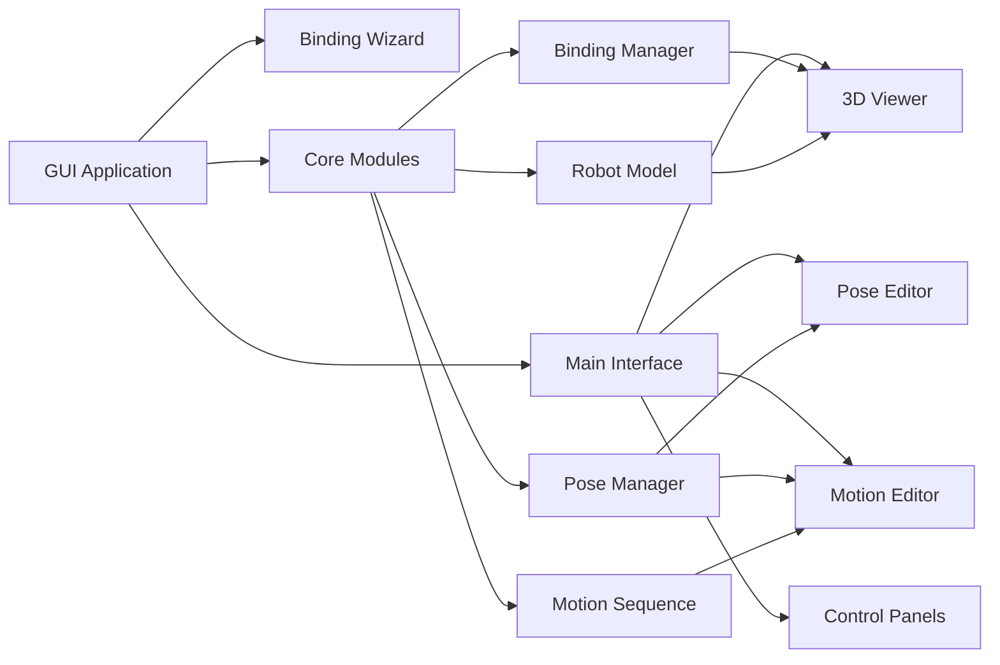
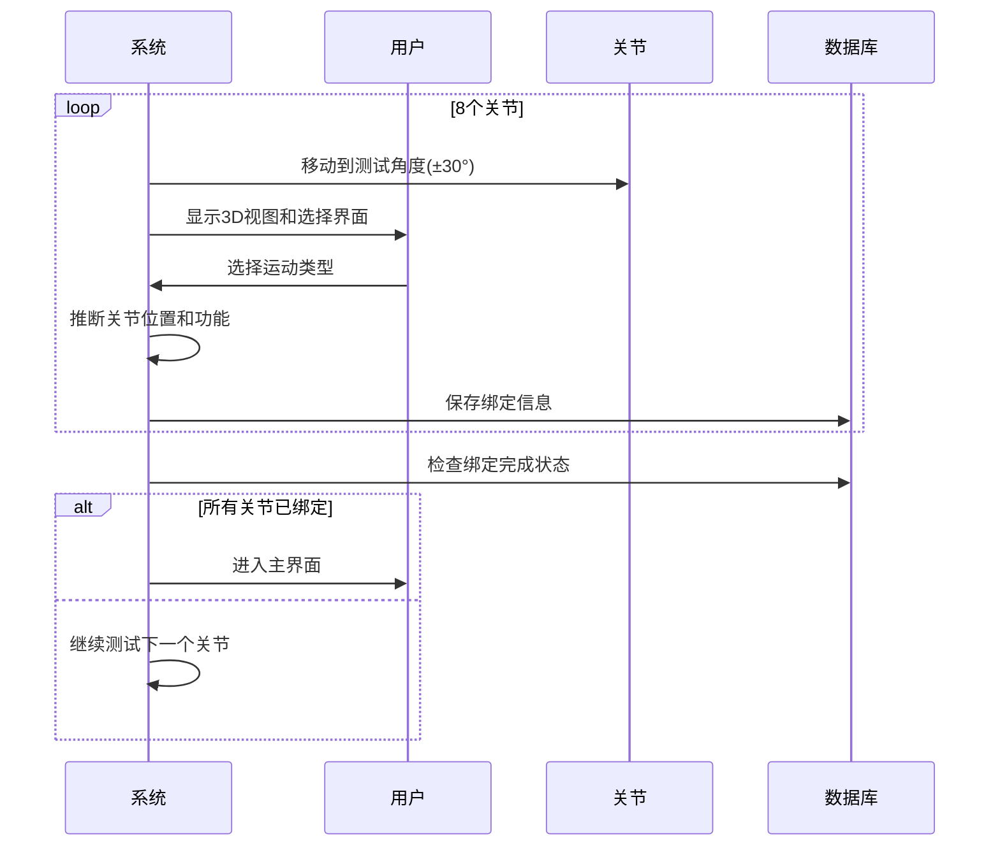
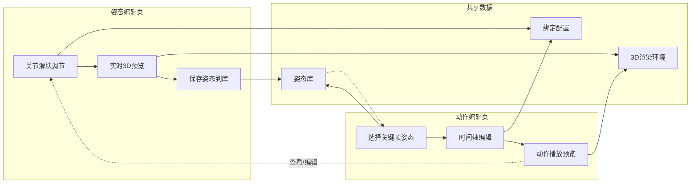
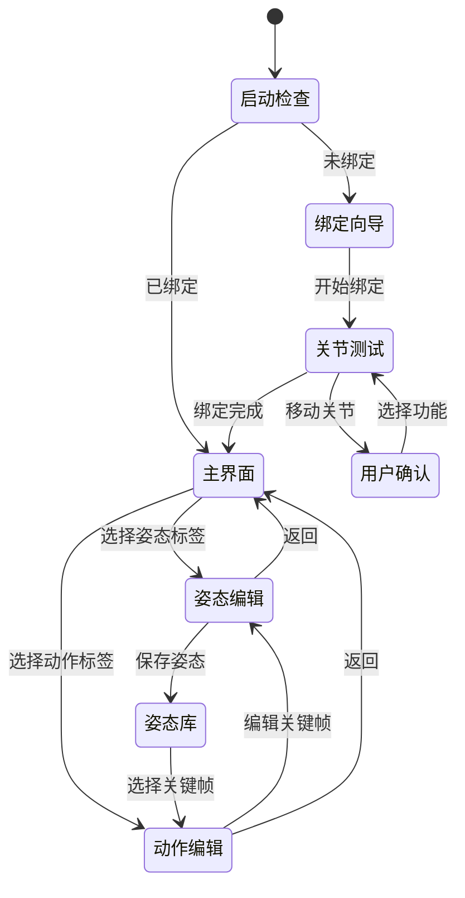
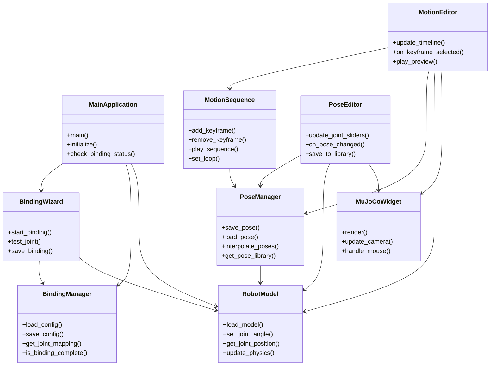

# ODogExample 开发任务纲要

## 🎯 项目概述

ODogExample 是一个基于 PySide6 + MuJoCo 的 8 自由度四足机器狗 GUI 应用，专注于四足机器人研发过程中的"过程"探索。

### 核心功能
1. **8自由度关节执行器探索绑定** - 通过运动测试智能识别关节功能
2. **8自由度四足机器狗动作姿态编辑** - 可视化姿态编辑和管理
3. **基于姿态编辑动作** - 时间轴动作序列编辑器

### 技术栈
- **GUI框架**: PySide6 (Qt6)
- **物理引擎**: MuJoCo
- **3D渲染**: OpenGL + MuJoCo Viewer
- **数据格式**: JSON (配置和姿态数据)
- **环境管理**: uv (与主项目共享)

## 📁 项目目录结构

```
ODogExample/
├── 📂 core/                  # 核心功能模块
│   ├── __init__.py
│   ├── robot_model.py        # 机器人模型封装
│   ├── joint_mapping.py      # 8自由度关节定义和映射
│   ├── binding_manager.py    # 关节绑定状态管理器
│   ├── binding_tester.py     # 运动测试绑定逻辑
│   ├── pose_manager.py       # 姿态管理（保存/加载/插值）
│   └── motion_sequence.py    # 动作序列生成
├── 📂 gui/                   # GUI界面模块
│   ├── __init__.py
│   ├── main_app.py           # 主应用入口
│   ├── binding_wizard.py     # 关节绑定向导（运动测试界面）
│   ├── control_panels.py     # 执行器控制面板
│   ├── pose_editor.py        # 姿态编辑器
│   ├── motion_editor.py      # 动作序列编辑器
│   ├── viewer_widget.py      # MuJoCo 3D渲染组件
│   └── gui_config.json       # GUI界面配置
├── 📂 tools/                 # 工具脚本
│   ├── viewer.py             # 现有命令行查看器
│   ├── interact_viewer.py    # 现有交互查看器
│   ├── binding_test.py       # 独立绑定测试工具
│   └── data_analyzer.py      # 数据分析工具
├── 📂 experiments/           # 实验记录
│   ├── binding_setup/        # 绑定设置实验记录
│   ├── pose_editing/         # 姿态编辑实验
│   ├── motion_generation/    # 动作生成实验
│   └── results/              # 实验结果数据
```

## 🎯 项目结构符合性分析

当前项目结构**完全符合**功能需求，采用了清晰的职责分离和模块化设计。以下是各类的详细职责分析：

### 📁 Core 模块职责

#### `robot_model.py`
- **职责**: 封装MuJoCo模型的核心操作
- **主要功能**:
  - 加载和初始化MuJoCo模型
  - 管理关节状态和物理仿真
  - 提供关节角度设置和获取接口
  - 处理3D渲染和物理更新
  - 管理模型配置和参数

#### `joint_mapping.py`
- **职责**: 定义和管理8自由度关节的映射关系
- **主要功能**:
  - 定义标准关节名称和ID映射
  - 提供关节位置推断逻辑
  - 管理关节运动范围限制
  - 验证关节映射的完整性
  - 提供关节信息查询接口

#### `binding_manager.py`
- **职责**: 管理关节绑定状态和配置
- **主要功能**:
  - 加载和保存绑定配置
  - 检查绑定完成状态
  - 管理绑定配置的版本控制
  - 提供绑定信息的查询接口
  - 处理绑定验证和错误检查

#### `binding_tester.py`
- **职责**: 实现运动测试绑定逻辑
- **主要功能**:
  - 执行关节运动测试
  - 收集用户反馈
  - 推断关节功能类型
  - 生成测试报告
  - 协调绑定流程的执行

#### `pose_manager.py`
- **职责**: 姿态数据的管理和操作
- **主要功能**:
  - 姿态数据的保存和加载
  - 姿态插值算法实现
  - 姿态库管理
  - 姿态验证和优化
  - 提供姿态查询和过滤接口

#### `motion_sequence.py`
- **职责**: 动作序列的生成和管理
- **主要功能**:
  - 关键帧管理
  - 动作序列播放控制
  - 时间轴计算
  - 循环和插值控制
  - 动作数据的序列化和反序列化

### 📁 GUI 模块职责

#### `main_app.py`
- **职责**: 应用程序的主入口和流程控制
- **主要功能**:
  - 初始化应用程序
  - 管理启动流程
  - 协调各模块间的交互
  - 处理全局事件和状态
  - 管理应用生命周期

#### `binding_wizard.py`
- **职责**: 关节绑定向导界面
- **主要功能**:
  - 显示绑定向导界面
  - 处理用户交互
  - 协调运动测试流程
  - 显示测试结果
  - 管理向导步骤切换

#### `control_panels.py`
- **职责**: 执行器控制面板组件
- **主要功能**:
  - 关节控制滑块
  - 实时参数显示
  - 控制按钮和状态指示
  - 对称编辑控制
  - 快速操作按钮

#### `pose_editor.py`
- **职责**: 姿态编辑器界面
- **主要功能**:
  - 姿态编辑主界面
  - 关节角度调节
  - 姿态库选择和管理
  - 实时3D预览同步
  - 姿态保存和加载

#### `motion_editor.py`
- **职责**: 动作序列编辑器界面
- **主要功能**:
  - 时间轴编辑界面
  - 关键帧管理界面
  - 动作播放控制
  - 插值参数设置
  - 动作序列预览

#### `viewer_widget.py`
- **职责**: MuJoCo 3D渲染组件（集成通用轨道相机）
- **主要功能**:
  - 集成通用轨道相机系统（OrbitCamera）
  - 3D模型渲染和物理仿真显示
  - 专业的相机交互控制（旋转、平移、缩放、FOV调整）
  - 鼠标和键盘事件处理（左键旋转、右键平移、滚轮缩放）
  - 自动适配模型视角和动态裁剪平面调整
  - 相机参数管理和调试支持

### 📁 Tools 模块职责

#### `viewer.py`
- **职责**: 独立的命令行查看器
- **主要功能**:
  - 无GUI的模型查看
  - 基本的关节控制
  - 简单的仿真运行
  - 调试和信息输出

#### `interact_viewer.py`
- **职责**: 交互式查看器
- **主要功能**:
  - 基础交互功能
  - 简单的关节测试
  - 模型状态检查
  - 交互式控制

#### `binding_test.py`
- **职责**: 独立的绑定测试工具
- **主要功能**:
  - 命令行绑定测试
  - 批量关节测试
  - 测试结果导出
  - 自动化测试支持

#### `data_analyzer.py`
- **职责**: 数据分析工具
- **主要功能**:
  - 姿态数据分析
  - 动作序列分析
  - 绑定配置分析
  - 性能数据统计
  - 报告生成

### 🎯 结构优势

1. **职责清晰**: 每个类都有明确的单一职责
2. **模块化**: 核心逻辑与界面分离，便于测试和维护
3. **可扩展**: 易于添加新功能和修改现有功能
4. **复用性**: 工具模块可以独立使用
5. **数据流清晰**: 模块间依赖关系明确

### 🔄 数据流关系



这种结构设计完全满足了项目的功能需求，具有良好的可维护性和扩展性。

## 🎯 通用轨道相机集成

### 相机在项目中的位置

通用轨道相机是ODogExample项目的**核心技术组件**，承担着3D可视化和用户交互的关键作用：

#### 核心作用
1. **3D可视化基础**: 为所有功能提供专业的3D模型显示
2. **用户交互入口**: 提供直观的模型观察和操作界面
3. **专业体验保障**: 达到商业3D软件的交互水准
4. **功能扩展平台**: 为后续功能提供坚实的可视化基础

#### 集成优势
- **专业级交互**: 符合专业3D软件操作习惯
- **性能优化**: 针对60FPS实时渲染优化
- **自适应设计**: 自动适配不同大小的模型
- **功能完整**: 支持旋转、平移、缩放、FOV调整等
- **扩展性强**: 支持动画系统、多视角管理等高级功能

#### 开发优先级
通用轨道相机应该作为**第一阶段的核心任务**，原因：
1. **建立用户信心**: 第一阶段就能获得专业级3D查看器
2. **技术风险控制**: 提前解决3D渲染和交互的技术难点
3. **基础架构完善**: 为后续功能提供稳定的可视化平台
4. **用户体验保障**: 确保整个项目的交互体验

### 集成实现方案

#### 代码组织
```
gui/viewer_widget.py
├── OrbitCamera类          # 通用轨道相机核心
├── InputHandler类         # 输入处理系统
├── InteractionMapper类    # 交互模式映射
├── MuJoCo集成逻辑         # MuJoCo渲染同步
└── 性能优化组件           # 渲染和交互优化
```

#### 关键特性
- **自动适配**: 双击/F键自动贴合模型最佳视角
- **智能裁剪**: 动态调整近裁剪平面避免深度冲突
- **流畅交互**: 60FPS的旋转、平移、缩放操作
- **专业控制**: 支持FOV调整和多种交互模式
- **调试支持**: 相机参数监控和性能统计

通过集成通用轨道相机，ODogExample项目将从一开始就具备专业级的3D可视化能力，为后续的关节绑定、姿态编辑和动作序列编辑功能提供坚实的视觉基础。
├── 📄 model.xml              # MuJoCo模型文件
├── 📄 model-actuator-position.xml # 执行器模型文件
├── 📄 component_positions.json # 位置数据
├── 📄 joint_binding_config.json # 关节绑定配置（运动测试结果）
├── 📄 binding_status.json    # 绑定状态文件
├── 📄 saved_poses.json       # 保存的姿态数据
├── 📄 motion_sequences.json  # 动作序列数据
├── 📄 f3d_export.log         # 导出日志
├── 📄 actuator_readme.md     # 执行器说明
├── 📄 export_description.md  # 导出说明
├── 📂 stl_files/             # STL文件目录（保持XML路径兼容）
│   ├── base_base.stl
│   ├── lbd_lbd.stl
│   ├── lbu_lbu.stl
│   ├── lfd_lfd.stl
│   ├── lfu_lfu.stl
│   ├── rbd_rbd.stl
│   ├── rbu_rbu.stl
│   ├── rfd_rfd.stl
│   └── rfu_rfu.stl
└── 📄 README.md              # 项目说明
```

## 🔄 系统架构设计

### 启动流程


### 核心模块关系


## 🔧 核心功能实现

### 1. 8自由度关节绑定

#### 关节定义
根据 `model.xml` 分析，8个关节为：
- **xuan_zhuan_1**: 左前腿髋关节 (lfu body)
- **xuan_zhuan_2**: 左前腿膝关节 (lfd body)  
- **xuan_zhuan_3**: 左后腿髋关节 (lbu body)
- **xuan_zhuan_4**: 左后腿膝关节 (lbd body)
- **xuan_zhuan_5**: 右后腿髋关节 (rbu body)
- **xuan_zhuan_6**: 右后腿膝关节 (rbd body)
- **xuan_zhuan_7**: 右前腿髋关节 (rfu body)
- **xuan_zhuan_8**: 右前腿膝关节 (rfd body)

#### 运动测试绑定流程


**详细步骤**:
1. **逐个关节测试**: 移动关节到测试角度（±30度）
2. **用户判断**: 用户观察运动效果并选择功能类型
   - 抬头/低头 → 前腿髋关节
   - 抬屁股/撅屁股 → 后腿髋关节
   - 腿前摆/后摆 → 膝关节
3. **逻辑推断**: 结合关节位置确定具体位置（左/右、前/后）
4. **配置保存**: 保存绑定配置到 `joint_binding_config.json`

#### 绑定配置数据结构
```json
{
  "binding_complete": true,
  "joint_mappings": {
    "xuan_zhuan_1": {
      "actuator_id": 0,
      "leg": "左前腿",
      "type": "髋关节",
      "description": "左前腿髋关节",
      "movement_range": [-90, 90],
      "test_angle": 30
    }
  },
  "binding_timestamp": "2025-09-16T10:30:00",
  "validation_passed": true
}
```

### 2. 姿态编辑系统

#### 姿态定义
姿态 = 8个关节的一组位置设定参数

#### 姿态数据结构
```json
{
  "pose_id": "stand_pose",
  "name": "站立姿态",
  "description": "标准站立姿势",
  "joint_angles": {
    "左前腿髋关节": 0.0,
    "左前腿膝关节": 0.0,
    "左后腿髋关节": 0.0,
    "左后腿膝关节": 0.0,
    "右前腿髋关节": 0.0,
    "右前腿膝关节": 0.0,
    "右后腿髋关节": 0.0,
    "右后腿膝关节": 0.0
  },
  "created_time": "2025-09-16T10:30:00",
  "modified_time": "2025-09-16T10:30:00",
  "tags": ["default", "standing"]
}
```

#### 姿态编辑功能
- **实时调节**: 8个关节滑块实时调节
- **3D预览**: 同步显示姿态效果
- **对称编辑**: 自动同步对称关节角度
- **姿态库**: 预设常用姿态（站立、蹲下、前倾等）
- **快速操作**: 归零、复制、保存、加载

### 3. 动作序列编辑器

#### 动作定义
动作 = 姿态位置参数 + 变换持续时间 + 维持时间 的一组集合

#### 动作数据结构
```json
{
  "motion_id": "walk_cycle",
  "name": "行走循环",
  "description": "标准行走步态",
  "keyframes": [
    {
      "pose_id": "stand_pose",
      "transition_duration": 0.5,
      "hold_duration": 0.2,
      "interpolation_type": "linear"
    },
    {
      "pose_id": "lift_left_front",
      "transition_duration": 0.3,
      "hold_duration": 0.1,
      "interpolation_type": "smooth"
    }
  ],
  "loop": true,
  "total_duration": 1.4,
  "created_time": "2025-09-16T10:35:00",
  "tags": ["gait", "walking"]
}
```

#### 动作编辑功能
- **时间轴编辑**: 可视化的关键帧时间轴
- **关键帧管理**: 添加、删除、修改关键帧
- **插值控制**: 线性/平滑插值选择
- **实时预览**: 动作序列实时播放
- **循环控制**: 支持循环播放设置

### 动作播放时间轴图

```mermaid
gantt
    title 动作序列播放时间轴
    dateFormat  s
    axisFormat %S
    
    section 前腿动作
    站立姿态     :a1, 0, 0.7s
    左前腿抬起   :a2, after a1, 0.3s
    左前腿放下   :a3, after a2, 0.3s
    右前腿抬起   :a4, after a3, 0.3s
    右前腿放下   :a5, after a4, 0.3s
    
    section 后腿动作
    站立姿态     :b1, 0, 0.7s
    左后腿抬起   :b2, after b1, 0.3s
    左后腿放下   :b3, after b2, 0.3s
    右后腿抬起   :b4, after b3, 0.3s
    右后腿放下   :b5, after b4, 0.3s
```


## 🎮 用户界面设计

### 主界面布局（标签页设计）
```
┌─────────────────────────────────────────────────────────────┐
│                    [姿态编辑] [动作编辑] [设置]                │
├─────────────────────────┬─────────────────────────────────┤
│                         │                                 │
│      3D 渲染视图          │       功能面板                 │
│                         │                                 │
│   [左前腿] [右前腿]       │  ┌─────────────────────────┐   │
│     │O│     │O│          │  │  姿态编辑器             │   │
│     │ │     │ │          │  │                         │   │
│   [左后腿] [右后腿]       │  │ [姿态库] [关节控制]     │   │
│     │O│     │O│          │  │                         │   │
│     │ │     │ │          │  └─────────────────────────┘   │
│                         │                                 │
│                         │  ┌─────────────────────────┐   │
│                         │  │  动作编辑器             │   │
│                         │  │                         │   │
│                         │  │ [时间轴] [关键帧]       │   │
│                         │  │                         │   │
│                         │  └─────────────────────────┘   │
│                         │                                 │
└─────────────────────────┴─────────────────────────────────┘
```

**界面设计说明**:
- **单窗口标签页设计**: 姿态编辑和动作编辑在同一窗口内的不同标签页
- **共享3D视图**: 两个编辑器共享同一个3D渲染视图，确保数据一致性
- **功能面板切换**: 右侧面板根据选择的标签页显示对应的功能控件
- **操作连贯性**: 避免多窗口切换，提供流畅的用户体验

### 关节绑定向导界面
```
🔧 关节功能绑定向导

步骤 2/8：测试关节 xuan_zhuan_1

[3D视图显示关节运动]

这个关节控制什么动作？
○ 抬头/低头      ○ 抬屁股/撅屁股
○ 腿前摆/后摆    ○ 腿内摆/外摆

[观察运动] [确认选择] [跳过] [重新测试]
```

### 姿态编辑器界面
```
🎯 姿态编辑器

┌─────────────────────────────────────────────────────────────┐
│                      3D 渲染视图                              │
│                                                             │
│   [左前腿] [右前腿]                                          │
│     │O│     │O│     姿态名称: 站立姿态                     │
│     │ │     │ │     描述: 标准站立姿势                   │
│   [左后腿] [右后腿]                                          │
│     │O│     │O│                                             │
│     │ │     │ │                                             │
│                                                             │
└─────────────────────────────────────────────────────────────┘

┌─────────────────────────┐  ┌─────────────────────────┐
│      关节角度控制       │  │      姿态操作          │
│                         │  │                         │
│ 左前腿髋关节:  ■□□□□□□□ │  │ 姿态库: [▼]            │
│ 左前腿膝关节: ■□□□□□□□ │  │                         │
│                         │  │ [保存到库] [新建姿态]   │
│ 左后腿髋关节:  ■□□□□□□□ │  │ [复制当前] [重置]       │
│ 左后腿膝关节: ■□□□□□□□ │  │                         │
│                         │  │ 当前姿态: 未保存       │
│ 右前腿髋关节:  ■□□□□□□□ │  │                         │
│ 右前腿膝关节: ■□□□□□□□ │  │                         │
│                         │  └─────────────────────────┘
│ 右后腿髋关节:  ■□□□□□□□ │
│ 右后腿膝关节: ■□□□□□□□ │
│                         │
│ [对称编辑] ✓ [全部归零] │
└─────────────────────────┘
```

### 动作编辑器界面（标签页内）
```
🎬 动作编辑标签页

左侧 3D 视图:                    右侧功能面板:
- 显示动作播放预览              ┌─────────────────────────┐
- 实时渲染动作序列              │    时间轴编辑器        │
- 支持播放控制                  │                      │
                               │ 站立姿态 ──0.5s→ 抬左前腿 │
                               │ [0.0s]    [0.5s]      │
                               │                      │
                               │ ┌────────────────────┐ │
                               │ │ 关键帧列表         │ │
                               │ │ 1. 站立姿态 [0.0s]│ │
                               │ │ 2. 抬左前腿 [0.5s]│ │
                               │ └────────────────────┘ │
                               │                      │
                               │ [添加] [删除] [播放] │
                               └─────────────────────────┘
```

### 标签页交互设计

#### 姿态编辑标签页
- **左侧3D视图**: 显示当前编辑的姿态，实时响应关节调节
- **右侧面板**: 
  - 姿态库选择器
  - 8个关节角度滑块
  - 对称编辑开关
  - 保存/加载/重置按钮

#### 动作编辑标签页
- **左侧3D视图**: 显示动作序列播放预览，支持播放控制
- **右侧面板**:
  - 时间轴编辑器
  - 关键帧列表
  - 姿态选择器（从姿态库选择）
  - 变换时间/保持时间设置
  - 插值方式选择

#### 标签页间数据流


**交互优势**:
1. **数据一致性**: 两个编辑器共享同一份姿态数据和3D渲染环境
2. **操作流畅**: 无需在多个窗口间切换，标签页切换快捷
3. **实时预览**: 编辑姿态时立即在3D视图中看到效果
4. **资源效率**: 避免重复加载3D模型，节省内存和CPU资源

### 数据状态流转图


## 🔧 核心算法实现

### 1. 姿态插值算法
```python
def interpolate_poses(pose1, pose2, t, interpolation_type="linear"):
    """
    在两个姿态之间插值
    t: 0.0到1.0之间的插值参数
    """
    if interpolation_type == "linear":
        # 线性插值
        result = {}
        for joint in pose1["joint_angles"]:
            angle1 = pose1["joint_angles"][joint]
            angle2 = pose2["joint_angles"][joint]
            result[joint] = angle1 + t * (angle2 - angle1)
        return result
    elif interpolation_type == "smooth":
        # 平滑插值 (使用余弦函数)
        smooth_t = 0.5 * (1 - math.cos(math.pi * t))
        return interpolate_poses(pose1, pose2, smooth_t, "linear")
```

### 2. 动作播放控制
```python
def play_motion_sequence(motion_data, callback=None):
    """
    播放动作序列
    callback: 每帧更新时的回调函数
    """
    import time
    
    start_time = time.time()
    current_pose = None
    
    for i, keyframe in enumerate(motion_data["keyframes"]):
        target_pose = get_pose(keyframe["pose_id"])
        
        if i == 0:
            # 第一个关键帧，直接设置
            current_pose = target_pose
            callback(current_pose)
            time.sleep(keyframe["hold_duration"])
        else:
            # 变换到目标姿态
            transition_start = time.time()
            transition_duration = keyframe["transition_duration"]
            
            while time.time() - transition_start < transition_duration:
                t = (time.time() - transition_start) / transition_duration
                t = min(1.0, t)
                
                interpolated = interpolate_poses(
                    current_pose, target_pose, t, keyframe["interpolation_type"]
                )
                callback(interpolated)
                time.sleep(0.016)  # ~60 FPS
            
            current_pose = target_pose
            time.sleep(keyframe["hold_duration"])
```

### 3. 关节绑定测试算法
```python
def test_joint_movement(joint_id, test_angle=30):
    """
    测试关节运动并获取用户反馈
    """
    # 移动关节到测试角度
    set_joint_angle(joint_id, test_angle)
    
    # 显示用户判断界面
    # 用户选择运动类型
    # 返回推断的关节信息
    
    movement_type = get_user_selection()
    joint_position = get_joint_position(joint_id)
    
    return infer_joint_info(movement_type, joint_position)

def infer_joint_info(movement_type, joint_position):
    """根据运动类型和位置推断关节信息"""
    x, y, z = joint_position
    
    if movement_type == "抬头/低头":
        leg_position = "前腿"
        joint_type = "髋关节"
        side = "左" if x < 0 else "右"
        
    elif movement_type == "抬屁股/撅屁股":
        leg_position = "后腿"
        joint_type = "髋关节"
        side = "左" if x < 0 else "右"
        
    elif movement_type == "腿前摆/后摆":
        leg_position = "前腿" if y > 0 else "后腿"
        joint_type = "膝关节"
        side = "左" if x < 0 else "右"
    
    return {
        'leg': f"{side}{leg_position}",
        'type': joint_type,
        'description': f"{side}{leg_position}{joint_type}"
    }
```

### 系统类关系图


## 📅 开发阶段规划

### 阶段1：基础框架搭建 (1-2周)
**目标**: 建立可运行的基础架构

**开发内容**:
- [x] 项目目录结构创建
- [ ] `core/robot_model.py` - 基础MuJoCo模型加载
- [ ] `gui/viewer_widget.py` - **集成通用轨道相机的3D渲染组件**
- [ ] `gui/main_app.py` - 主应用框架
- [ ] 基础依赖配置和环境检查

**验证标准**:
- ✅ 能够加载model.xml并显示3D模型
- ✅ 基础窗口可以正常启动和显示
- ✅ **通用轨道相机功能完整**：
  - 左键拖动：轨道旋转
  - 右键拖动或Shift+左键：平移
  - 滚轮：距离缩放
  - Ctrl+滚轮：FOV调整
  - 双击或F键：自动适配模型
- ✅ 相机参数自动适配和动态裁剪平面调整
- ✅ 无严重错误和崩溃

**预期效果**: 
- 获得一个**专业级3D模型查看器**，具备完整的轨道相机功能
- 建立开发信心和基础架构
- 为后续功能开发奠定坚实基础
- **用户体验达到商业3D软件水准**

---

### 阶段2：关节控制基础 (1周)
**目标**: 实现基础的关节控制功能

**开发内容**:
- [ ] `core/joint_mapping.py` - 关节映射定义
- [ ] `gui/control_panels.py` - 关节控制滑块
- [ ] 关节角度实时设置和获取
- [ ] 简单的关节角度限制

**验证标准**:
- ✅ 可以通过滑块控制8个关节
- ✅ 关节运动在3D视图中实时显示
- ✅ 关节角度限制正常工作
- ✅ 滑块数值与实际关节角度同步

**预期效果**:
- 获得一个可以手动控制关节的工具
- 验证MuJoCo模型和关节的可用性
- 为后续绑定系统提供控制基础

---

### 阶段3：关节绑定向导 (1-2周)
**目标**: 实现半自动的关节绑定功能

**开发内容**:
- [ ] `core/binding_manager.py` - 绑定状态管理
- [ ] `core/binding_tester.py` - 运动测试逻辑
- [ ] `gui/binding_wizard.py` - 绑定向导界面
- [ ] 用户交互逻辑和反馈机制

**验证标准**:
- ✅ 可以逐个测试关节运动
- ✅ 用户界面清晰显示测试进度
- ✅ 能够保存和加载绑定配置
- ✅ 绑定结果可以通过配置文件验证

**预期效果**:
- 获得完整的关节绑定功能
- 用户可以一次性完成所有关节的绑定
- 绑定结果可以重复使用

---

### 阶段4：姿态编辑系统 (1-2周)
**目标**: 实现完整的姿态编辑功能

**开发内容**:
- [ ] `core/pose_manager.py` - 姿态数据管理
- [ ] `gui/pose_editor.py` - 姿态编辑界面
- [ ] 姿态库的保存和加载
- [ ] 对称编辑功能

**验证标准**:
- ✅ 可以编辑和保存多个姿态
- ✅ 姿态库可以正常加载和显示
- ✅ 对称编辑功能正常工作
- ✅ 姿态切换时3D视图同步更新

**预期效果**:
- 获得完整的姿态编辑功能
- 用户可以创建和管理常用姿态
- 为动作序列编辑提供姿态基础

---

### 阶段5：动作序列编辑 (2-3周)
**目标**: 实现动作序列编辑和播放功能

**开发内容**:
- [ ] `core/motion_sequence.py` - 动作序列管理
- [ ] `gui/motion_editor.py` - 动作编辑界面
- [ ] 时间轴编辑器
- [ ] 动作播放控制和插值算法

**验证标准**:
- ✅ 可以创建和编辑动作序列
- ✅ 时间轴显示清晰，可以调整关键帧
- ✅ 动作播放流畅，插值自然
- ✅ 循环播放和暂停功能正常

**预期效果**:
- 获得完整的动作编辑功能
- 用户可以创建复杂的动作序列
- 实现项目的核心功能目标

---

### 阶段6：集成优化和工具完善 (1-2周)
**目标**: 完善工具链和用户体验

**开发内容**:
- [ ] `tools/` 目录下的工具完善
- [ ] 性能优化和错误处理
- [ ] 用户体验改进
- [ ] 文档和使用说明完善

**验证标准**:
- ✅ 独立工具可以正常使用
- ✅ 程序运行稳定，无明显性能问题
- ✅ 错误处理完善，用户友好
- ✅ 文档完整，新用户可以上手使用

**预期效果**:
- 获得一个完整、稳定、易用的系统
- 支持多种使用场景（GUI、命令行、工具）
- 项目达到可用状态

---

## 🎯 开发策略建议

### 迭代式开发
1. **每个阶段都有可交付成果**: 确保每个阶段结束都有可以运行的程序
2. **及时验证**: 每完成一个功能就立即测试，避免问题积累
3. **渐进式增强**: 在前一阶段基础上构建新功能

### 风险控制
1. **技术风险优先**: 先解决MuJoCo集成和3D渲染等技术难点
2. **用户体验验证**: 每个阶段都要确保用户界面友好
3. **数据安全**: 重要配置和数据要及时保存和备份

### 质量保证
1. **功能测试**: 每个功能都要有对应的测试验证
2. **性能测试**: 定期检查程序运行性能
3. **用户体验测试**: 确保操作流程符合直觉

### 预期成果时间线
- **第2周**: 基础3D查看器 ✅
- **第3周**: 关节控制工具 ✅  
- **第5周**: 完整绑定功能 ✅
- **第7周**: 姿态编辑功能 ✅
- **第10周**: 动作编辑功能 ✅
- **第12周**: 完整可用系统 ✅

这种渐进式的开发方式可以确保每个阶段都能获得正反馈，及时发现问题并调整方向。

## 🎯 技术要点

### 关键技术
1. **MuJoCo集成**: 模型加载、物理仿真、3D渲染
2. **PySide6界面**: 现代化GUI设计、实时交互
3. **实时渲染**: 60 FPS流畅动画
4. **状态管理**: 绑定状态、配置管理、数据持久化
5. **插值算法**: 线性/平滑插值实现

### 注意事项
1. **性能优化**: 避免3D渲染阻塞GUI线程
2. **数据同步**: 确保3D视图与控制面板数据一致
3. **错误处理**: 完善的异常处理机制
4. **用户体验**: 直观的操作流程和反馈

## 📋 配置文件说明

### GUI配置 (gui_config.json)
- 界面布局参数
- 颜色主题设置
- 默认参数配置

### 绑定配置 (joint_binding_config.json)
- 关节映射关系
- 绑定状态标记
- 测试参数设置

### 姿态数据 (saved_poses.json)
- 预设姿态库
- 用户自定义姿态
- 姿态分类标签

### 动作数据 (motion_sequences.json)
- 动作序列定义
- 关键帧配置
- 播放参数设置

## 🚀 部署和运行

### 环境要求
- Python 3.8+
- PySide6
- MuJoCo
- NumPy
- uv (包管理)

### 启动方式
```bash
# 启动主应用
python gui/main_app.py

# 命令行工具
python tools/viewer.py
python tools/binding_test.py
```

### 数据文件
- 所有数据文件保存在项目根目录
- 支持配置文件的热重载
- 自动备份重要数据

---

这个文档作为ODogExample项目的完整开发指导，涵盖了从技术架构到具体实现的所有方面。开发过程中可以根据实际情况调整和优化具体实现方案。