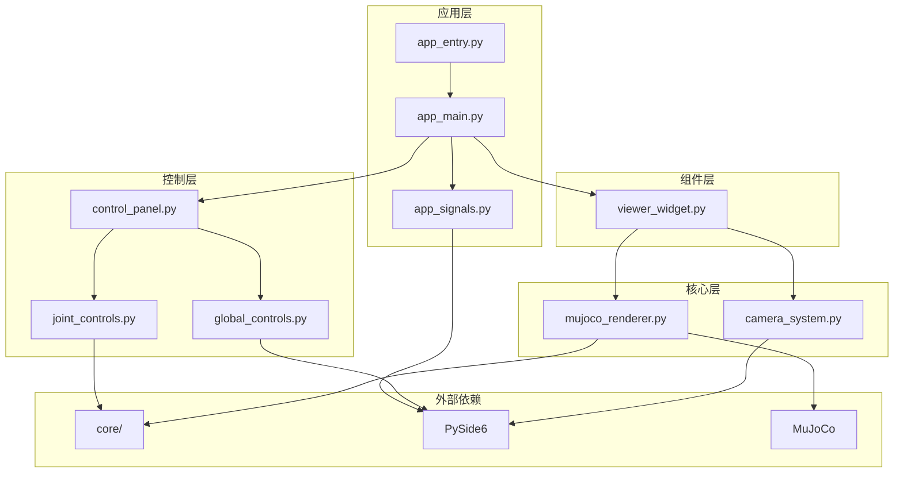
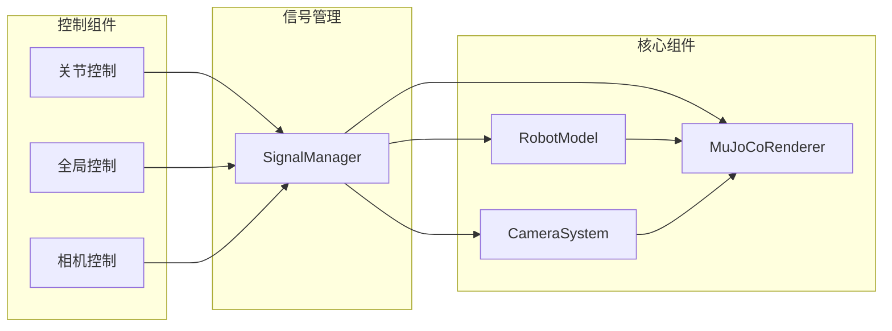

# ODogExample GUI模块架构设计文档

## 📋 概述

本文档详细描述了ODogExample项目中GUI模块的架构设计方案。通过对大型Python文件进行模块化拆分，我们实现了更好的代码组织、可维护性和可扩展性。

## 🎯 架构设计原则

### 核心设计理念
1. **单一职责原则**: 每个模块都有明确的功能边界
2. **松耦合设计**: 模块间通过信号槽机制通信，减少直接依赖
3. **可复用性**: 组件可以在不同上下文中独立使用
4. **向后兼容**: 保持原有API的兼容性，支持渐进式迁移

## 📁 模块拆分前后对比

### 拆分前结构（原始）
```
gui/
├── main_app.py        # 296行 - 主应用入口
├── control_panels.py  # 786行 - 所有UI控制面板
└── viewer_widget.py   # 709行 - 3D渲染和相机控制
```

### 拆分后结构（模块化）
```
gui/
├── 📄 核心功能组件
│   ├── camera_system.py        # 轨道相机和输入处理
│   └── mujoco_renderer.py      # MuJoCo渲染核心
├── 📄 控制面板组件
│   ├── joint_controls.py       # 单个关节和腿部控制
│   ├── global_controls.py      # 全局控制、相机控制、姿态控制
│   └── control_panel.py        # 控制面板组装
├── 📄 应用程序组件
│   ├── app_main.py             # 主应用程序窗口
│   ├── app_signals.py          # 全局信号管理
│   └── app_entry.py           # 应用程序入口
├── 📄 界面组件
│   └── viewer_widget.py        # 3D查看器组件
├── 📄 兼容性包装器
│   ├── main_app.py            # 原有入口的包装器
│   └── control_panels.py      # 原有控制面板的包装器
└── __init__.py               # 模块导出配置
```

## 🏗️ 详细模块架构

### 1. 核心功能组件

#### camera_system.py - 相机系统模块
**职责**: 提供通用的轨道相机控制器和输入处理器

**核心类**:
- `OrbitCamera`: 通用轨道相机控制器
  - 相机参数管理（方位角、仰角、距离、FOV）
  - 相机操作（轨道旋转、平移、缩放、FOV调整）
  - 自动适配模型视角
  - 动态裁剪平面调整
- `InputHandler`: 输入处理器
  - 鼠标事件处理（按下、移动、释放、滚轮）
  - 键盘状态管理
  - 交互状态跟踪

**关键特性**:
- 针对小型模型优化的相机参数
- 支持多种交互模式（旋转、平移、缩放）
- 实时调试信息输出
- 性能优化的渲染循环

#### mujoco_renderer.py - 渲染核心模块
**职责**: 封装MuJoCo的渲染和物理仿真功能

**核心类**:
- `MuJoCoRenderer`: MuJoCo渲染器
  - OpenGL和MuJoCo资源管理
  - 物理仿真控制
  - 渲染性能优化
  - 相机跟踪功能

**关键特性**:
- 60FPS流畅渲染
- 智能相机跟踪
- 性能监控和统计
- 错误处理和恢复

### 3. 控制面板组件

#### joint_controls.py - 关节控制模块
**职责**: 提供单个关节和腿部控制组件

**核心类**:
- `JointControlWidget`: 单个关节控制组件
  - 关节角度滑块控制
  - 精细模式切换
  - 实时角度显示
  - 关节信息展示
- `LegControlGroup`: 腿部控制组
  - 对称编辑功能
  - 腿部整体控制
  - 快速操作按钮

**关键特性**:
- 支持精细控制模式（0.1°精度）
- 对称关节自动同步
- 实时角度验证
- 用户友好的界面设计

#### global_controls.py - 全局控制模块
**职责**: 提供全局控制、相机控制、姿态控制功能

**核心类**:
- `GlobalControlGroup`: 全局控制组
  - 所有关节归零/重置
  - 同步到机器人功能
- `PrecisionControlGroup`: 精细控制组
  - 全局精细模式切换
  - 控制说明显示
- `CameraControlGroup`: 相机控制组
  - 相机跟踪开关
  - 重新聚焦功能
  - 控制说明显示
- `PoseControlGroup`: 姿态控制组
  - 姿态保存/加载
  - 姿态信息显示

**关键特性**:
- 一键全局操作
- 相机智能跟踪
- 姿态管理功能
- 清晰的状态反馈

#### control_panel.py - 控制面板组装模块
**职责**: 集成所有控制组件，提供统一的控制面板

**核心类**:
- `ControlPanel`: 主控制面板
  - 组件布局管理
  - 信号路由和分发
  - 事件协调处理

**关键特性**:
- 模块化组件集成
- 统一的信号管理
- 灵活的布局配置

### 3. 应用程序层

#### app_main.py - 主应用程序模块
**职责**: 提供主应用程序窗口和界面管理

**核心类**:
- `MainApplication`: 主应用程序
  - 窗口布局管理
  - 组件生命周期管理
  - 全局状态管理
  - 事件处理协调

**关键特性**:
- 分栏式界面设计
- 响应式布局
- 全局状态同步
- 错误处理机制

#### app_signals.py - 信号管理模块
**职责**: 提供全局信号管理和事件分发

**核心类**:
- `SignalManager`: 信号管理器
  - 全局信号定义
  - 信号路由管理
  - 事件分发机制

**关键特性**:
- 集中式信号管理
- 松耦合通信
- 事件路由优化

#### app_entry.py - 应用入口模块
**职责**: 提供应用程序的启动入口和初始化

**核心函数**:
- `setup_application()`: 应用程序设置
- `create_main_window()`: 主窗口创建
- `run_application()`: 应用程序运行
- `main()`: 主入口函数

**关键特性**:
- 应用程序初始化
- 优雅的错误处理
- 启动信息输出

### 4. 界面组件层

#### viewer_widget.py - 3D查看器模块
**职责**: 集成相机系统和渲染器的3D查看器组件

**核心类**:
- `MuJoCoViewerWidget`: 3D查看器组件
  - 3D渲染集成
  - 用户交互处理
  - 相机控制集成
  - 仿真控制功能

**关键特性**:
- 专业的3D渲染
- 流畅的用户交互
- 集成的仿真控制
- 完整的键盘快捷键

## 🔗 模块间依赖关系

### 依赖层次图
```
应用程序组件 (app_main.py, app_entry.py, app_signals.py)
    ↓
控制面板组件 (control_panel.py, joint_controls.py, global_controls.py)
    ↓
界面组件 (viewer_widget.py)
    ↓
核心功能组件 (camera_system.py, mujoco_renderer.py)
    ↓
外部依赖 (core/, PySide6, MuJoCo)
```

### 详细依赖关系



## 🔄 信号槽架构

### 信号流向设计


### 主要信号定义

#### 应用程序信号
- `application_started`: 应用程序启动完成
- `application_closing`: 应用程序即将关闭

#### 关节控制信号
- `joint_angle_changed`: 关节角度改变
- `joint_precision_toggled`: 关节精细模式切换
- `leg_symmetry_toggled`: 腿部对称编辑切换

#### 全局控制信号
- `all_joints_zero`: 所有关节归零
- `all_joints_reset`: 所有关节重置
- `sync_to_robot`: 同步到机器人

#### 相机控制信号
- `camera_tracking_toggled`: 相机跟踪开关
- `camera_refocus`: 相机重新聚焦

## 🛠️ 向后兼容性设计

### 兼容性包装器

#### main_app.py (兼容性包装器)
```python
# 保持原有导入方式
from .app_entry import main

# 保持原有类名引用
MainApplication = None  # 已移动到 app_main.py

def main():
    """主应用入口 - 重定向到新的应用入口"""
    from .app_entry import main as new_main
    return new_main()
```

#### control_panels.py (兼容性包装器)
```python
# 保持原有导入方式
from .control_panel import create_control_panel

# 保持原有类名引用
JointControlWidget = None  # 已移动到 joint_controls.py
LegControlGroup = None     # 已移动到 joint_controls.py
GlobalControlGroup = None  # 已移动到 global_controls.py
```

### 导入兼容性
```python
# 原有导入方式仍然有效
from gui.main_app import main
from gui.control_panels import create_control_panel

# 新的模块化导入方式
from gui.app_entry import main
from gui.control_panel import create_control_panel
```

## 📊 性能优化策略

### 1. 渲染优化
- **帧率控制**: 限制渲染频率为30FPS，减少CPU使用
- **资源复用**: 复用OpenGL和MuJoCo资源对象
- **视口优化**: 智能调整渲染视口和投影矩阵

### 2. 内存管理
- **对象池**: 复用频繁创建的对象
- **延迟加载**: 按需加载大型资源
- **垃圾回收**: 及时清理不再使用的对象

### 3. 交互优化
- **事件节流**: 减少频繁的事件处理
- **状态缓存**: 缓存计算结果，避免重复计算
- **异步处理**: 将耗时操作放到后台线程

## 🔧 错误处理机制

### 1. 模块级错误处理
- **导入错误**: 自动回退到绝对导入
- **资源加载**: 优雅降级和错误恢复
- **运行时错误**: 异常捕获和用户友好提示

### 2. 全局错误处理
- **应用程序级别**: 未捕获异常的统一处理
- **渲染级别**: OpenGL和MuJoCo错误的特殊处理
- **用户界面**: 错误状态的可视化反馈

## 📝 代码质量保证

### 1. 代码组织
- **单一文件原则**: 每个文件只包含一个主要功能
- **清晰的命名**: 使用描述性的类名和函数名
- **文档字符串**: 为所有公共API提供文档

### 2. 类型提示
- **完整类型注解**: 使用Python类型提示提高代码可读性
- **IDE友好**: 支持现代IDE的智能提示和检查
- **运行时检查**: 在开发时进行类型验证

### 3. 测试策略
- **单元测试**: 对每个模块进行独立测试
- **集成测试**: 测试模块间的协作
- **兼容性测试**: 确保向后兼容性

## 🚀 扩展性设计

### 1. 插件架构
- **模块化设计**: 新功能可以作为独立模块添加
- **标准接口**: 定义统一的组件接口
- **动态加载**: 支持运行时动态加载新模块

### 2. 配置驱动
- **可配置参数**: 通过配置文件控制行为
- **主题系统**: 支持界面主题切换
- **语言国际化**: 支持多语言界面

### 3. API设计
- **分层API**: 提供不同层次的API接口
- **版本兼容**: 保持API的向后兼容性
- **扩展点**: 预留功能扩展的接口

## 🎯 未来发展方向

### 1. 功能扩展
- **动作编辑器**: 完整的动作序列编辑功能
- **姿态管理**: 高级姿态库和管理功能
- **绑定系统**: 智能关节绑定向导

### 2. 技术改进
- **多线程**: 将渲染和UI分离到不同线程
- **GPU加速**: 利用GPU加速渲染和计算
- **网络功能**: 支持远程控制和监控

### 3. 用户体验
- **自定义界面**: 支持用户自定义界面布局
- **快捷键系统**: 完整的快捷键配置
- **脚本支持**: 支持Python脚本扩展

## 📋 总结

ODogExample的GUI模块架构设计体现了现代软件工程的最佳实践：

1. **模块化**: 将大型文件拆分为功能明确的小模块
2. **可维护性**: 清晰的代码组织和依赖关系
3. **可扩展性**: 为未来功能预留了扩展空间
4. **向后兼容**: 保持原有API的兼容性
5. **性能优化**: 针对实时渲染和交互的优化
6. **错误处理**: 完善的异常处理和恢复机制

这种架构设计不仅解决了当前的开发需求，还为项目的长期发展奠定了坚实的基础。通过清晰的模块划分和标准化的接口设计，团队成员可以独立开发和测试各个模块，大大提高了开发效率和代码质量。